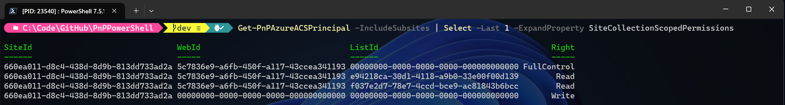

# ACS Deprecation

As [announced back in November 2023](https://techcommunity.microsoft.com/blog/spblog/azure-acs-retirement-in-microsoft-365/3982039) already, Microsoft will deprecate ACS (Access Control Services) for new tenants as of November 1st, 2024 and it will stop working for existing tenants and will be fully retired as of April 2nd, 2026. This applies to all environments including Government Clouds and Department of Defense. In essence, we're talking about the `_layouts/appregnew.aspx`, `_layouts/appinv.aspx` and `_layouts/appprincipals.aspx` pages that will be going away.

## What does this mean for me?
If you're using any application registrations that have formerly been set up through `_layouts/appregnew.aspx`, it will stop working on above mentioned dates. It does not matter if you're using it with PnP PowerShell, through an SharePoint Add-In, direclty using CSOM (Client Side Object Model), direct `_api` calls to SharePoint, or any other means.

## What can I do to ensure my applications remain working
Simple: replace them with a proper Entra ID Application Registration. 

If the `_layouts/apprenew.aspx` was done in December 2024 or later, it will already [have created an Entra ID Application registration](https://learn.microsoft.com/sharepoint/dev/sp-add-ins/add-ins-and-azure-acs-retirements-faq#when-i-use-appregnewaspx-the-created-acs-principals-show-up-in-entra) for you. To validate this, simply take the Client ID/App Id of your application, go to [Entra ID](https://entra.microsoft.com), navigate to Identity > Applications > App registrations, click on the "All applications" tab and search for your Client ID/App ID. If it yields a result, it means your application also exists in Entra ID. If you go into the Entra ID Application registration and click on API permissions you will likely see no permissions being added to it. This is a clear indicator that this application registration has been done through `_layouts/appregnew.aspx` in or after December 2024, that it created an Entra ID Application registration counterpart, but that it still leverages ACS for its authentication. Add the required permissions here to ensure you can use this Entra ID Application registraton going forward.

If you cannot find an entry in Entra ID with the same Client ID/App ID, it means the `_layouts/appregnew.aspx` operation has been done before December 2024 and no entry exists for it yet in Entra ID. You can [manually create your own new Entra ID Application registration](registerapplication.md#manually-create-an-app-registration-for-interactive-login) or use [Register-PnPAzureADApp](../cmdlets/Register-PnPAzureADApp.md#example-7) to create one for you.

## How to I find out about which ACS Application Registrations my tenant has

### Using the Microsoft 365 Assessment Tool
One way would be to [use the Microsoft 365 Assessment Tool to have it generate an overview for you](https://pnp.github.io/pnpassessment/addinsacs/readme.html) which will list out where ACS application registrations are being used.

### Using PnP PowerShell
Another option would be to create something yourself using PnP PowerShell. The advantage of this option could be that you can easily automate the entire process, from detecting ACS Application registrations, to creating their Entra ID Application registration counterparts, to setting permissions on them.

To find out which ACS Application registrations exist on your tenant, you can leverage [Get-PnPAzureACSPrincipal](Get-PnPAzureACSPrincipal.md) to connect to each site collection and execute:

```powershell
Get-PnPAzureACSPrincipal -IncludeSubsites
```

Ensure the Entra ID Application registration you connect with to SharePoint Online to perform this cmdlet has at least delegated Sites.FullControl.All permissions on SharePoint and delegated Application.Read.All permissions on Microsoft Graph.

The output of this cmdlet will be a list of ACS Application registrations that exist on that site. Under its SiteCollectionScopedPermissions and TenantScopedPermissions you will find the permissions that have been set on each of these. For example, to pull down these details for the first ACS Application registration on the site collection scoped permissions, run:

```powershell
Get-PnPAzureACSPrincipal -IncludeSubsites | Select -First 1 -ExpandProperty SiteCollectionScopedPermissions
```

It produces an output similar to:



The SiteId, WebId and ListId columns in this output, give away what kind of permissions have been set on the ACS Application registration. If a column contains just zeroes (00000000-0000-0000-0000-000000000000), it means the permissions have not been set down to that level. If it contains something else (i.e. 5c7836e9-a6fb-450f-a117-43ccea341193), it means that permissions have been set on that level. So to make it concrete, for the above sample, the following permissions have been set on this ACS Application Registration:  

- FullControl on the Web scope
- Read on the list with id e94218ca-30d1-4118-a9b0-33e00f00d139
- Read on the list with id f037e2d7-78e7-4ccd-bce9-ac81843b6bcc
- Write on the site collection scope

With this information, you can now start mapping these permissions to the equivallents in Entra ID. For direct access to SharePoint, the most fine grained permission you can select for now would be Sites.Selected, which provides read, write, manage or full control access to an entire site collection. Nothing more fine grained. Alternatively you could rewrite your code to make its calls through Microsoft Graph instead of directly towards SharePoint Online, in which case [you do have more fine grained permissions](https://learn.microsoft.com/en-us/graph/permissions-selected-overview?tabs=http).

The above example again would map to:

- Sites.Selected

Use [Grant-PnPAzureADAppSitePermission](../cmdlets/Grant-PnPAzureADAppSitePermission.md) to set FullControl permissions on it.

## What do I need to change in my code?

### PnP PowerShell
If you were connecting using PnP PowerShell, you will have to switch to using a certificate instead of a clientsecret and update your Connect-PnPOnline to something such as:

```powershell
Connect-PnPOnline https://contoso.sharepoint.com -CertificatePath c:\temp\pnp.pfx -Clientid xxx-xxx-xxx-xxx-xxx -Tenant xxx-xxx-xxx-xxx-xxx
```

For all the possible connection options, check the documentation of [Connect-PnPOnline](../cmdlets/Connect-PnPOnline.md).

### PnP Core

There are many ways to connect through PnP Core. Also in this scenario, you will have to authenticate using a Client ID and Certificate. There's no one off sample that works for every scenario. Have a look at the [PnP Core Authentication documentation](https://pnp.github.io/pnpcore/using-the-sdk/configuring%20authentication.html) for inspiration towards the possible options.

### CSOM

Here as well you need to use a certificate to connect. A sample piece of code demonstrating how to do this using the native Client Side Object Model (CSOM) is:

```c#
using Microsoft.Identity.Client;
using Microsoft.SharePoint.Client;
using System;
using System.Security.Cryptography.X509Certificates;

class Program
{
    static void Main()
    {
        string siteUrl = "https://yourtenant.sharepoint.com/sites/yoursite";
        string tenantId = "your-tenant-id";
        string clientId = "your-client-id";
        string certThumbprint = "your-cert-thumbprint";
        string authority = $"https://login.microsoftonline.com/{tenantId}";

        // Load certificate from store
        var store = new X509Store(StoreLocation.CurrentUser);
        store.Open(OpenFlags.ReadOnly);
        var cert = store.Certificates.Find(X509FindType.FindByThumbprint, certThumbprint, false)[0];
        store.Close();

        // Acquire token
        var app = ConfidentialClientApplicationBuilder.Create(clientId)
            .WithCertificate(cert)
            .WithAuthority(new Uri(authority))
            .Build();

        string[] scopes = { "https://yourtenant.sharepoint.com/.default" };
        var result = app.AcquireTokenForClient(scopes).ExecuteAsync().Result;

        // Connect to SharePoint
        using (var context = new ClientContext(siteUrl))
        {
            context.ExecutingWebRequest += (sender, e) =>
            {
                e.WebRequestExecutor.RequestHeaders["Authorization"] = "Bearer " + result.AccessToken;
            };

            Web web = context.Web;
            context.Load(web);
            context.ExecuteQuery();

            Console.WriteLine("Connected to site: " + web.Title);
        }
    }
}
```
