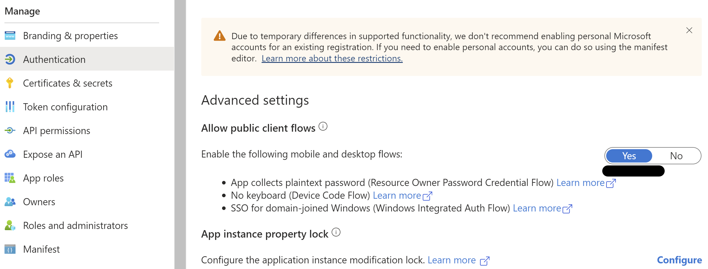
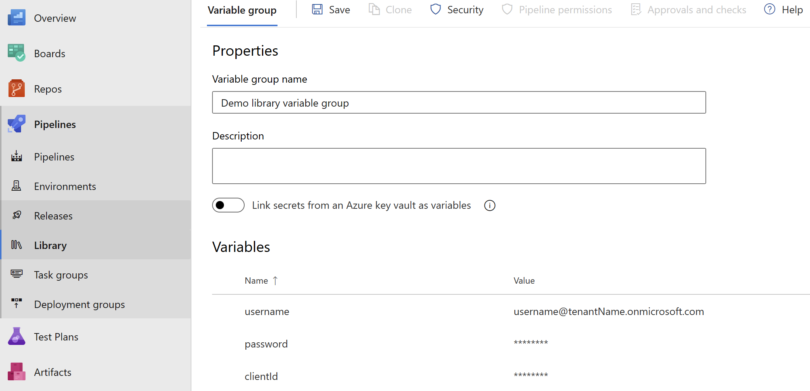
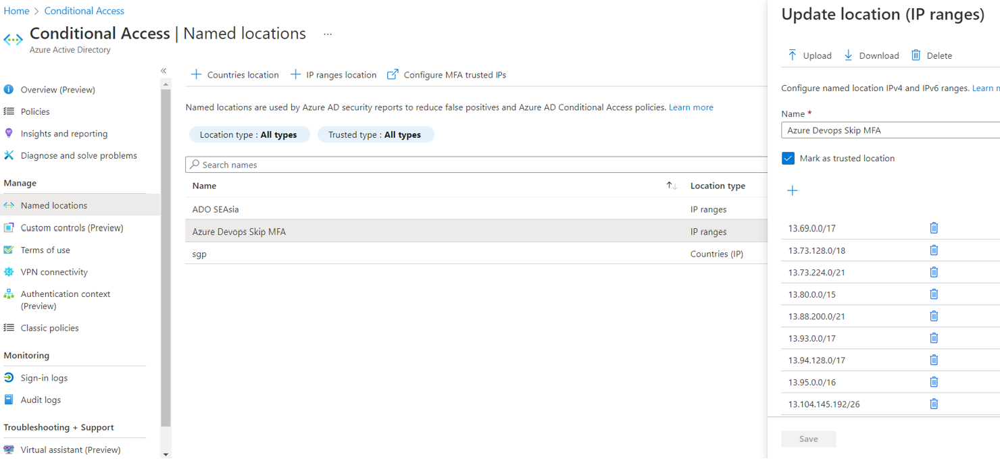
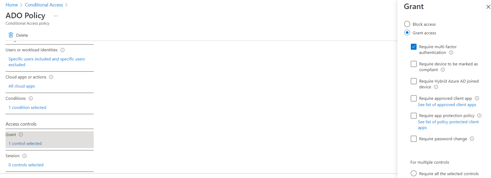

# Authentication

Before you can authenticate using PnP PowerShell, you need to ensure you have [created your own application registration](registerapplication.md) first and that you have [set the proper permissions](determinepermissions.md) on the application registration.

PnP PowerShell offers many different ways to authenticate to your tenant. Based on what you would like to achieve, pick the method that best suits your needs below.

Instead of having to provide `-ClientId` on every connect, you can also opt to [configure a default Client ID](defaultclientid.md) that will be used if `-ClientID` is not being specified in your `Connect-PnPOnline`.

## Interactive Authentication

This is the easiest method to authenticate, but it requires you to enter your credentials and go through multi factor authentication and conditional access policy steps, if applicable, each time you connect. This works perfectly well if your intend is to manually run scripts, but is not suitable to run unattended scripts at i.e. timed intervals.

Connecting can be done using:

```powershell
Connect-PnPOnline [yourtenant].sharepoint.com -Interactive -ClientId <client id of your Entra ID Application Registration>
```

This will show a popup window which will allow to authenticate and step through the multi-factor authentication flow. Ensure you provide [the Client ID of your own Entra ID Application Registration](registerapplication.md) with the `-ClientId` parameter.

## Authenticating from another device or specific browser

In some scenarios it can happen that you need to authenticate to PnP PowerShell from a different device or through a specific browser. In these cases you can use the `-DeviceLogin` method to connect. A sample scenario could for example be when running PnP PowerShell scripts on a Raspberry Pi without a desktop environment installed on it. In this case there is no browser to authenticate through on the device itself.

Connecting can be done using:

```powershell
Connect-PnPOnline [yourtenant].sharepoint.com -DeviceLogin -ClientId <client id of your Entra ID Application Registration>
```

When running this line, it will prompt in text to go to https://microsoft.com/devicelogin on any device and log in using a specific code which will be shown in the text. You can perform this step on any device. This does not have to be the same device as you're using PnP PowerShell on. After going to that website and entering the code shown in the text, you can complete the interactive login process as normal, including any multi factor authentication requirements that might have been set up for your account. Once the authentication completes, PnP PowerShell will automatically detect this and will be ready to be used.

## Authenticating using Web Account Manager

Another option to authenticate is using Web Account Manager (WAM). WAM is a more secure & faster way of authenticating in Windows OS. It supports Windows Hello, FIDO keys, single sign on, conditional access policies, and more. It only works on Windows 10 (Version 1703 - Creators Update) and above, as well as Windows Server 2019 and above.

Connecting can be done using:

```powershell
Connect-PnPOnline [yourtenant].sharepoint.com -OSLogin -ClientId <client id of your Entra ID Application Registration>
```

## Non interactive Authentication

If your goal is to automatically connect to PnP PowerShell without user intervention of having to enter credentials or perform multi factor authentication steps, this is the method to go with. Ensure you have gone through the [steps to set up an App Only application registration](registerapplication.md#setting-up-access-to-your-own-entra-id-app-for-app-only-access) first. Your application registration needs to use a public/private key pair certificate to authenticate. A client secret is not supported. The public key (.cer) goes into your application registration in Entra ID, the private key (.pfx) will be used to connect using PnP PowerShell.

Depending on how you have the certificate available, choose the section below that matches your scenario.

### Non interactive Authentication using a certificate file

If you have the private key certificate (.pfx) stored as a physical file on your machine, you can connecting using:

```powershell
Connect-PnPOnline [yourtenant].sharepoint.com -ClientId <client id of your Entra ID Application Registration> -Tenant <tenant>.onmicrosoft.com -CertificatePath <path to your .pfx certificate> 
```

If your private key (.pfx) certificate has a password on it, add `-CertificatePassword (ConvertTo-SecureString -AsPlainText 'myprivatekeypassword' -Force)` to the parameters.

### Non interactive Authentication using a certificate in the Windows Certificate Store

If you have the private key certificate (.pfx) added to the Windows Certificate Store (certmgr. msc) in the Personal > Certificates branch on your machine, you can connecting using:

```powershell
Connect-PnPOnline [yourtenant].sharepoint.com -ClientId <client id of your Entra ID Application Registration> -Tenant <tenant>.onmicrosoft.com -Thumbprint <thumbprint that can be found in the certificate> 
```

### Non interactive Authentication using a base64 representation of the certificate

This scenario is typically used when having the private key certificate (.pfx) stored as base64. This can for example be the case when [using PnP PowerShell within Azure Functions](azurefunctions.md). In this case you can connect using:

```powershell
Connect-PnPOnline [yourtenant].sharepoint.com -ClientId <client id of your Entra ID Application Registration> -Tenant <tenant>.onmicrosoft.com -CertificateBase64Encoded <base64 encoded pfx certificate> 
```

If your private key (.pfx) certificate has a password on it, add `-CertificatePassword (ConvertTo-SecureString -AsPlainText 'myprivatekeypassword' -Force)` to the parameters.

If you wish to convert a private key certificate file to its Base64 encoded equivalent, you can use:

```powershell
$bytes = Get-Content '.\PnPPowerShell.pfx' -AsByteStream
$encodedPfx = [System.Convert]::ToBase64String($bytes)
```

## Authenticating by providing an access token

A really specific and limited scenario is where you provide the oAuth JWT access token yourself that needs to be used to access resources. You can only pass in one access token and you need to ensure the token is still within its validity period and has the proper audience and scopes for the cmdlets you are going to execute. I.e. if you pass in an access token for your SharePoint Online tenant, you can only execute cmdlets that will directly target your SharePoint Online environment. If you would use a cmdlet that communicates with Microsoft Graph behind the scenes, it will throw an access denied exception.

Connecting can be done using:

```powershell
Connect-PnPOnline [yourtenant].sharepoint.com -AccessToken <oAuth JWT access token>
```

## Authenticating with Credentials

This method allows you to connect by just providing your username and password. It will not work with multi factor authentication. Therefore this method is less recommended.

Connecting can be done using:

```powershell
Connect-PnPOnline [yourtenant].sharepoint.com -ClientId <client id of your Entra ID Application Registration> -Credentials (Get-Credential)
```

and you will be prompted for credentials. Ensure you provide [the Client ID of your own Entra ID Application Registration](registerapplication.md) with the `-ClientId` parameter.

## Authenticating with pre-stored credentials using the Windows Credential Manager (Windows only)

This method can be used if you just intend to use PnP PowerShell on a Windows device, you want to use just a username and password for an account that does not require multi factor authentication, and you wish to store these credentials in the Windows Credential Manager so you don't have to enter them every time you connect. As this will not work with multi factor authentication, this method is less recommended.

Adding your credentials to the Windows Credential Manager, which is a one time operation, can be done using:

```powershell
Add-PnPStoredCredential -Name "yourlabel" -Username youruser@domain.com
```

You will be prompted to provide a password. After that you can login using:

```powershell
Connect-PnPOnline [yourtenant].sharepoint.com -ClientId <client id of your Entra ID Application Registration> -Credentials "yourlabel"
```

When you create the stored credentials (with Add-PnPStoredCredential or any other tool) if the Name you give it is the URL for your tenant you can omit the `-Credentials` parameter with `Connect-PnPOnline`. Using the example above create your stored credential with this command:

```powershell
Add-PnPStoredCredential -Name "https://[yourtenant].sharepoint.com" -Username youruser@contoso.com
```

When connecting to https://yourtenant.sharepoint.com you can use this command:

```powershell
Connect-PnPOnline [yourtenant].sharepoint.com -ClientId <client id of your Entra ID Application Registration>
```

Connect-PnPOnline will look through the Windows Credential Manager for a credential matching the URL. If it finds one it will use it. It will also match that credential with deeper connection URLs like https://yourtenant.sharepoint.com/sites/IT. You can create additional stored credentials for deeper sites if you routinely connect to them with different credentials. If you want to connect with a different set of credentials you can use the -Credentials parameter to specify them. A stored credential can be used for other URLs, like the Admin site:

```powershell
Connect-PnPOnline [yourtenant]-admin.sharepoint.com -ClientId <client id of your Entra ID Application Registration> -Credentials https://[yourtenant].sharepoint.com 
```

## Authenticating with pre-stored credentials using the Secrets Management Module from Microsoft (Multi-Platform)

This method can be used if you just intend to use PnP PowerShell on a Windows, Linux or iOS device, you want to use just a username and password for an account that does not require multi factor authentication, and you wish to store these credentials in the a Credential Manager so you don't have to enter them every time you connect. As this will not work with multi factor authentication, this method is less recommended.

Adding your credentials to the Credential Manager, which is a one time operation, can be done using:

```powershell
Install-Module -Name Microsoft.PowerShell.SecretManagement -AllowPrerelease
Install-Module -Name Microsoft.PowerShell.SecretStore -AllowPrerelease
Set-SecretStoreConfiguration
Set-Secret -Name "yourlabel" -Secret (Get-Credential)
```

This creates a new secret vault on your computer. You will be asked to provide a password to access the vault. If you access the vault you will be prompted for that password. In case you want to want to write automated scripts you will have to turn off this password prompt as follows:

```powershell
Set-SecretStoreConfiguration -Authentication None
```

For more information about these cmdlets, check out the github repositories: https://github.com/powershell/secretmanagement and https://github.com/powershell/secretstore.

After you set up the vault and you added a credential, you can connect using:

```powershell
Connect-PnPOnline [yourtenant].sharepoint.com -ClientId <client id of your Entra ID Application Registration> -Credentials (Get-Secret -Name "yourlabel")
```

## Authentication to GCC or National Cloud environments

In order to connect to a GCC or a national cloud environment, ensure you have followed the [specific steps for setting up the application registration for national clouds](#special-instructions-for-gcc-or-national-cloud-environments).

Connecting can be done using:

```powershell
Connect-PnPOnline [yourtenant].sharepoint.com -Interactive -ClientId [clientid] -Tenant [yourtenant].onmicrosoft.com -AzureEnvironment [USGovernment|USGovernmentHigh|USGovernmentDoD|Germany|China]
```

The AzureEnvironment parameter only allows one value. Select the correct one that matches your cloud deployment.

## Silent Authentication with Credentials for running in Pipelines

For running `Connect-PnPOnline` with user credentials in Azure DevOps pipeline, you need to make sure that authentication in your Entra ID application is configured to allow public client. 

Public client can be configured from the Azure portal from the Authentication Blade in the application or by setting the `allowPublicClient` property in the application's manifest to true.


`username` and `password` for service account can be stored as secret pipeline variables and can be referenced in the script to achieve complete automation.


## Silent Authentication with Credentials and MFA for running in Azure DevOps Pipelines with Microsoft Hosted Agents
### Identify the possible IP ranges for Microsoft-hosted agents

- Identify the [region for your organization](https://docs.microsoft.com/en-us/azure/devops/organizations/accounts/change-organization-location?view=azure-devops) in Organization settings.
- Identify the [Azure Geography](https://azure.microsoft.com/global-infrastructure/geographies/) for your organization's region.
- Map the names of the regions in your geography to the format used in the weekly file, following the format of AzureCloud., such as AzureCloud.westus. You can map the names of the regions from the Azure Geography list to the format used in the weekly file.
- You can find the weekly IP file at the following URL: https://www.microsoft.com/en-us/download/details.aspx?id=56519

For example, if your organization is located in the South East Asia region, you would map it to the format AzureCloud.SouthEastAsia.

### Create a named location in Entra ID conditional access

- Go to Entra ID conditional access
- Open named location blade, click on `+ IP Ranges Location`
- Enter the IP ranges for Microsoft Hosted Agents, `Mark as trusted location` should be checked.
  


### Create a conditional access policy

- Go to Entra ID conditional access, click on `+New Policy`.
- Give a meaningful name, click on Users and Groups -> Include select users and groups, select the user with which you want to run your pipeline.
- Include all cloud apps.
- Under conditions -> locations include `any locations` and exclude the recently created named location.
- Under grant -> choose `grant access`. Only `require multifactor authentication needs to be checked`.
- Enable the policy and click on Save.


> [!Important]
> You need to make sure that the new policy does not conflicts with any other policy in your tenant, otherwise make the changes accordingly.

### Powershell script to be run in pipeline
```powershell
$creds = New-Object System.Management.Automation.PSCredential -ArgumentList ($username, $password)
Connect-PnPOnline -Url <site url> -Credentials $creds -ClientId <Application/Client ID of Entra ID app>
```
