# Using PnP PowerShell in Azure Automation Runbooks

In this article we will setup an Azure Automation Rubook to use PnP PowerShell.

## Create the Azure Automation Runbook

As the UI in [the Azure Portal](https://portal.azure.com) changes every now and then, but the principles stay the same, follow the following steps:

1. Go to the [Azure Portal](https://portal.azure.com) and login with your Azure credentials

1. Create a new Azure Automation Account using the **Create a resource** button and searching for **Automation** or use this [direct link](https://portal.azure.com/#create/Microsoft.AutomationAccount) to locate it
   
   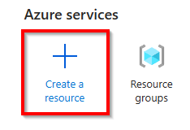

   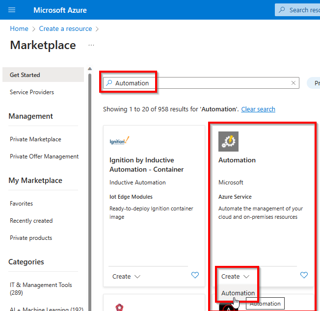

1. Fill out the details for the Azure Automation Account as desired and click **Review + Create** at the bottom left followed by clicking on **Create** on the review screen

   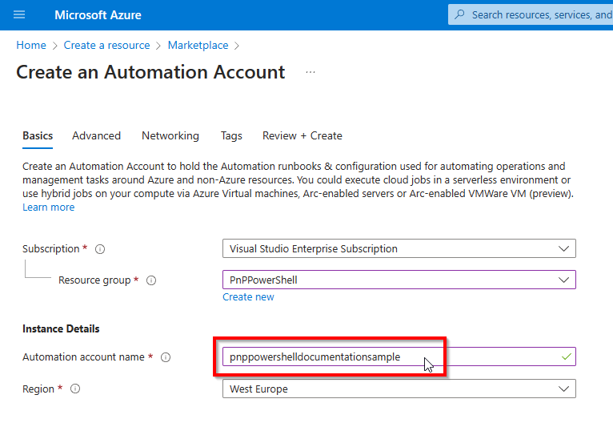

1. Once the resource has been created, click on **Go to resource** to open the Azure Automation resource

   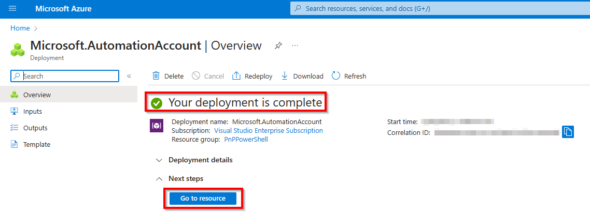

## Configure the Azure Automation Account

Now your Azure Automation Account has been created, proceed with the next paragraphs to configure it for using PnP PowerShell.

### Add the PnP PowerShell module to the Azure Automation Account

To add PnP PowerShell to the Azure Automation Account, follow these steps:

1. Navigate to `Modules` which is located the left side menu of the function app under the `Shared Resources` header.
   
   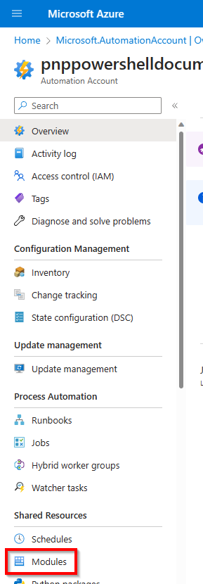

1. Click on **Add a module** at the top of the screen

   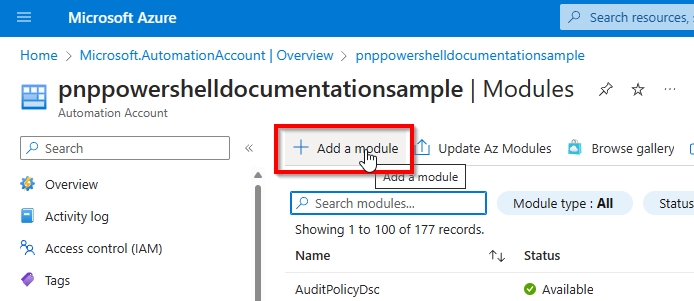

   Choose from the following options:

#### Specific stable version

   > [!Important]
   > Currently stable PnP PowerShell version that works with Azure Automation 7.2 Runbooks is **2.1.1**. 
   > If you would like to use a [latest nightly build] (#latest-prerelease-version) instead, use the below instructions

   Select **Browse from gallery**, Runtime version **7.2 (preview)** and click on the **Click here to browse from gallery** link

   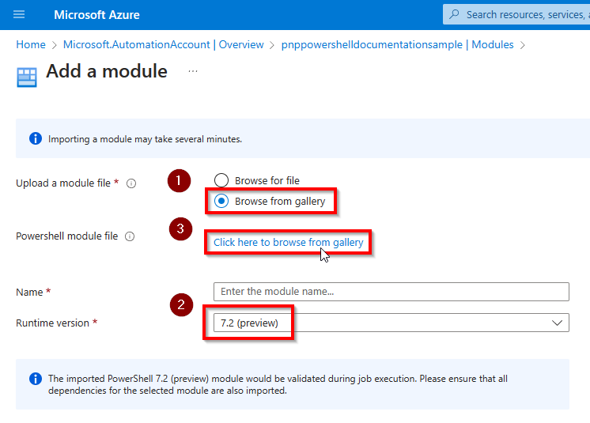

   Search for PnP PowerShell and select the first result.

   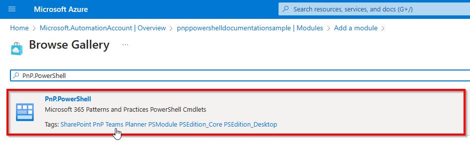

   Click on **Select** to confirm.

   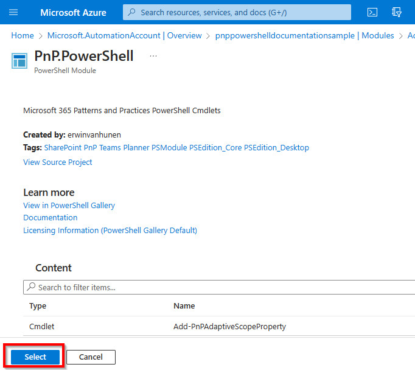

   Click on **Import** to start the download and importing process.

   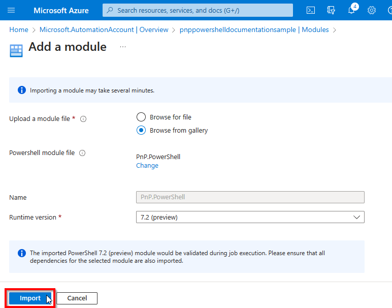

   It will take up to 10 minutes for the import to complete. You can check the import status by changing the **Module type** filter to **Custom**.

   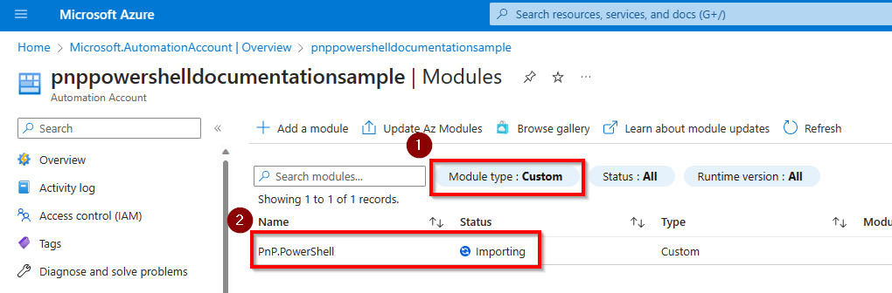

   Once it's done, it will show the status **Available**

   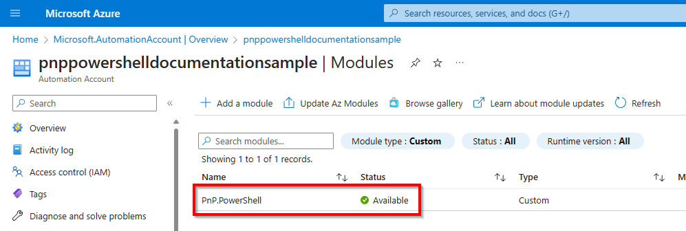

#### Latest prerelease version

   If you wish to use the latest prerelease/nightly build version, open up a PowerShell 7 console and execute:

   ```powershell
   Save-Module PnP.PowerShell -AllowPrerelease -Path c:\temp
   ```

   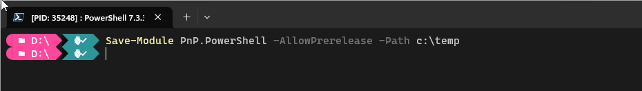

   Using Windows File Explorer, go to the folder where you downloaded the PnP PowerShell package. You should see a folder called `PnP.PowerShell` in there. Right click on it and choose the option **Compress to ZIP file**.

   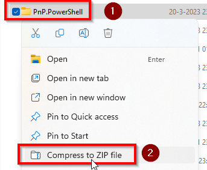

   Select **Browse for file**, Runtime version **7.2 (preview)** and click on the folder icon next to **Powershell module file** and select the zipped up PnP.PowerShell.zip file generated in the previous step.

   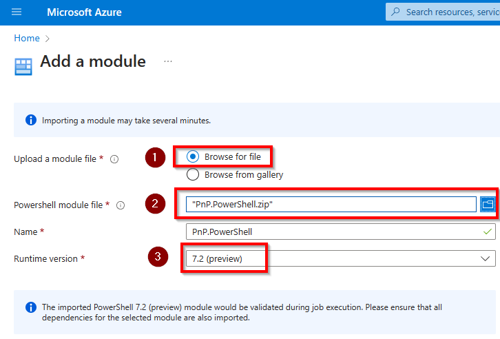

   Click on **Import** to start the download and importing process.

   It will take up to 10 minutes for the import to complete. You can check the import status by changing the **Module type** filter to **Custom**.

   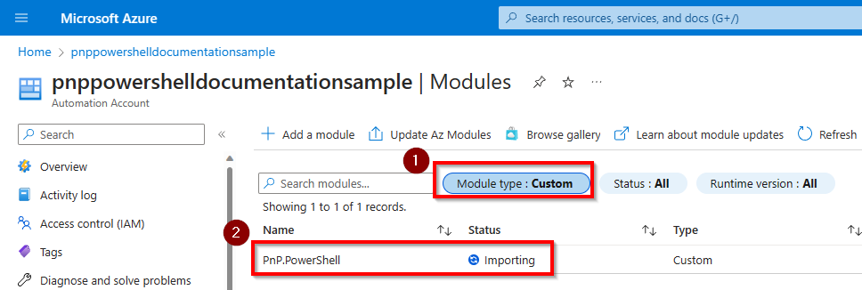

   Once it's done, it will show the status **Available**

   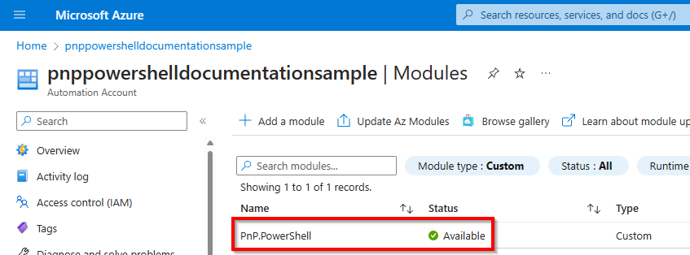   

## Decide how you want to authenticate in your Azure Automation Runbooks

### By using a Managed Identity

The recommended option is to use a [managed identity in Azure](https://learn.microsoft.com/azure/active-directory/managed-identities-azure-resources/overview) to allow your Azure Automation Runbook to connect to Microsoft Graph or SharePoint Online using PnP PowerShell. Using this method, you specifically grant permissions for your Azure Runbook to access these permissions, without having any client secret or certificate pair that potentially could fall into wrong hands. This makes this option the most secure option by far. Since version 1.11.95-nightly, Managed Identities are both supported against SharePoint Online as well as Microsoft Graph cmdlets. Before this version, only Microsoft Graph was being supported.

#### Enabling the managed identity for an Azure Automation Runbook

1. In your Azure Automation account, in the left menu, go to **Identity** under Account Settings

1. Ensure you are on the **System assigned** tab and flip the switch for Status to On, if not already done

1. Click the **Save** button and confirm your action in the dialog box that will be shown

A new entry will now automatically be created in your Azure Active Directory for this app having the same name as your Azure Function and the Object (principal) ID shown on this page. Take notice of the Object (principal) ID. We will need it in the next section to assign permissions to.

#### Assigning permissions to the managed identity

Next step is to assign permissions to this managed identity so it is authorized to access the Microsoft Graph and/or SharePoint Online.

1. If you don't know which permissions exist yet, you can use the below sample to get a list of all available permissions:

    ```powershell
    Get-PnPAzureADServicePrincipal -BuiltInType MicrosoftGraph | Get-PnPAzureADServicePrincipalAvailableAppRole
    Get-PnPAzureADServicePrincipal -BuiltInType SharePointOnline | Get-PnPAzureADServicePrincipalAvailableAppRole
    ```

1. Once you know which permissions you would like to assign, you can use the below samples. Note that the Principal requires the object Id (not the application/client id) or the application name.

   ```powershell
   Add-PnPAzureADServicePrincipalAppRole -Principal "62614f96-cb78-4534-bf12-1f6693e8237c" -AppRole "Group.Read.All" -BuiltInType MicrosoftGraph
   Add-PnPAzureADServicePrincipalAppRole -Principal "mymanagedidentity" -AppRole "Sites.FullControl.All" -BuiltInType SharePointOnline
   ```

## Create a Runbook

We're now ready to create a Runbook in which your PnP PowerShell script will run.

1. In the Azure Portal, in the left menu, click on **Runbooks** under **Process Automation**

   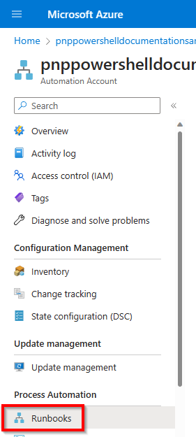

1. Click on **Create a runbook** at the top of the screen

   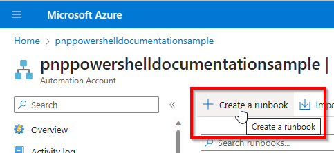

1. Give the Runbook a name, select the Runbook type **PowerShell** and for the Runtime version choose **7.2 (preview)** and click on **Create** at the bottom left.

   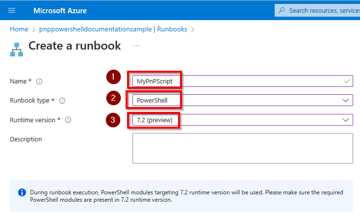

1. On the Edit PowerShell Runbook page, enter your PnP PowerShell code in the large white area, i.e.:

   ```powershell
   Connect-PnPOnline -ManagedIdentity

   Get-PnPMicrosoft365Group
   ```

   Once done, click on **Save** at the top of the screen and then on **Test pane** to test your Runbook.
   
   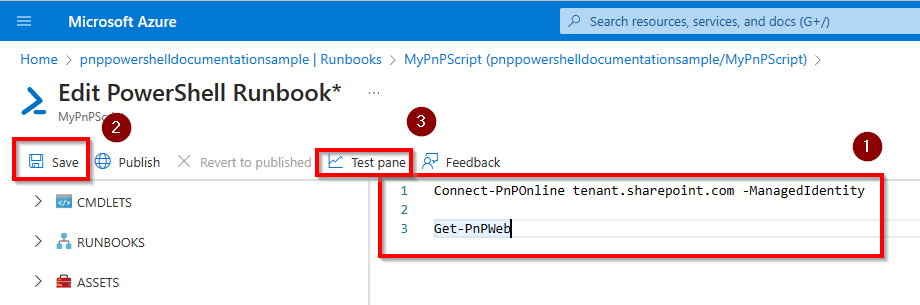

1. Click on **Start** to start testing the Runbook. It might take a few minutes for the Runbook to start. Once it's done, you will see the output of your PnP PowerShell script in the large black output section.

   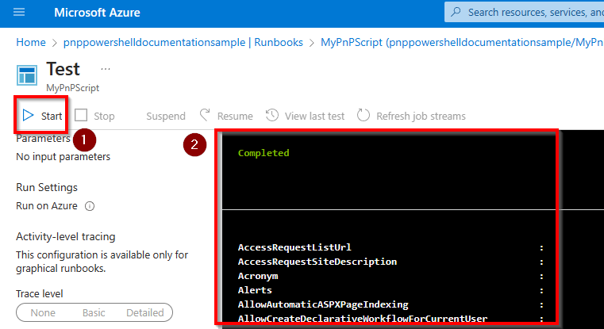
