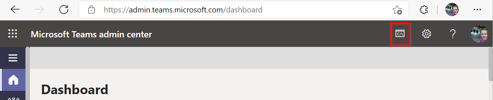
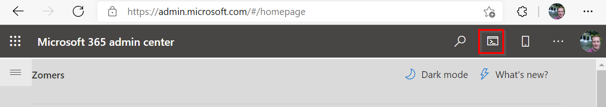
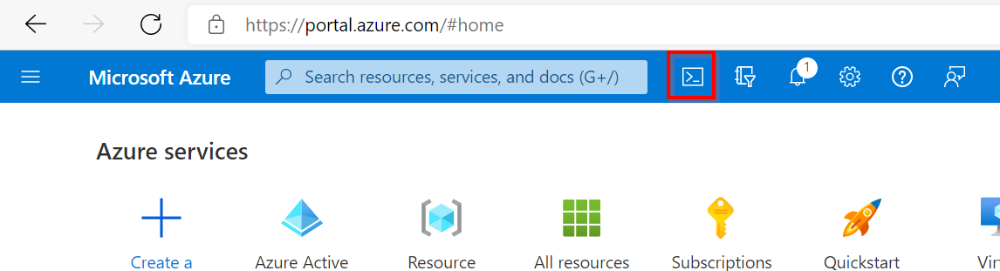
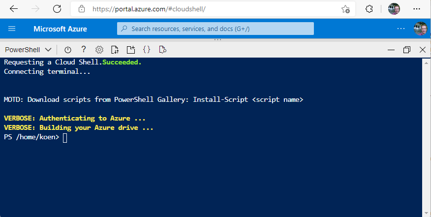
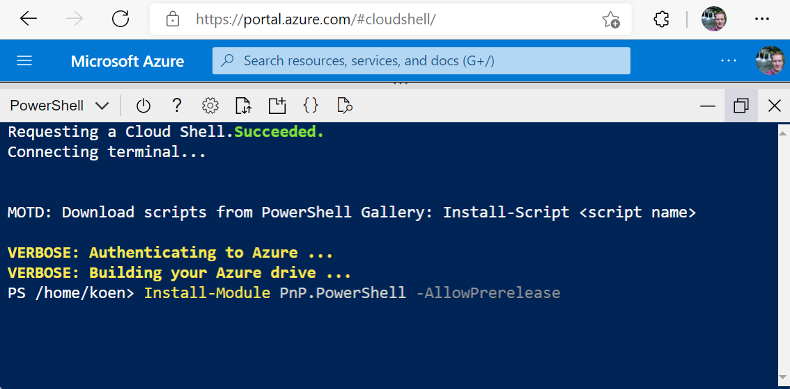
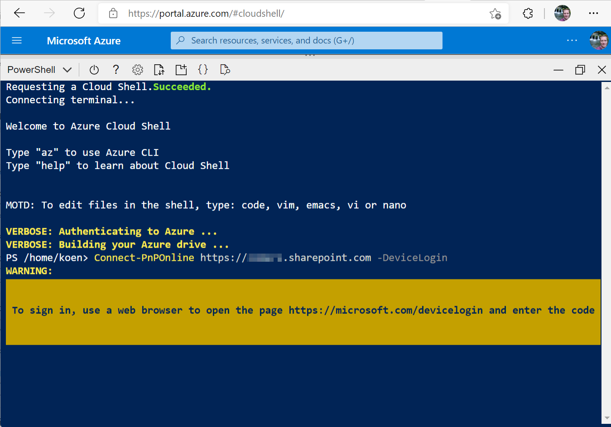
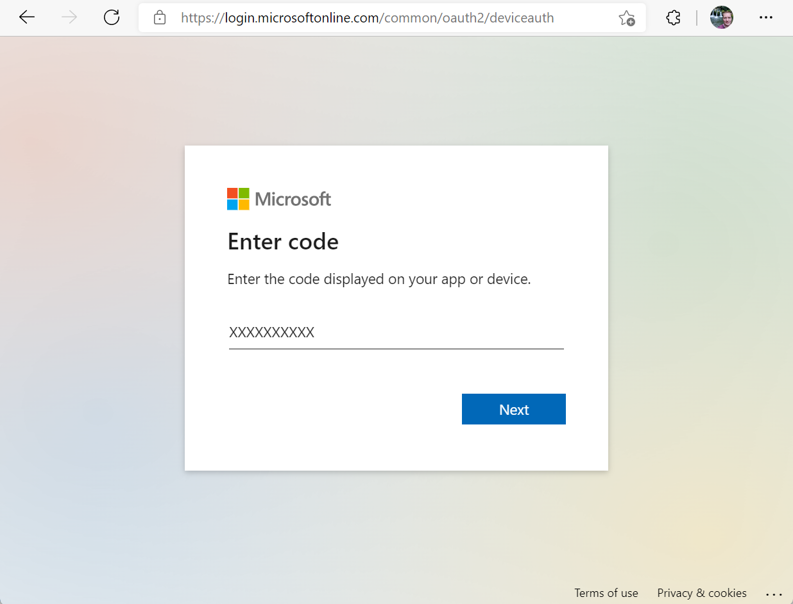
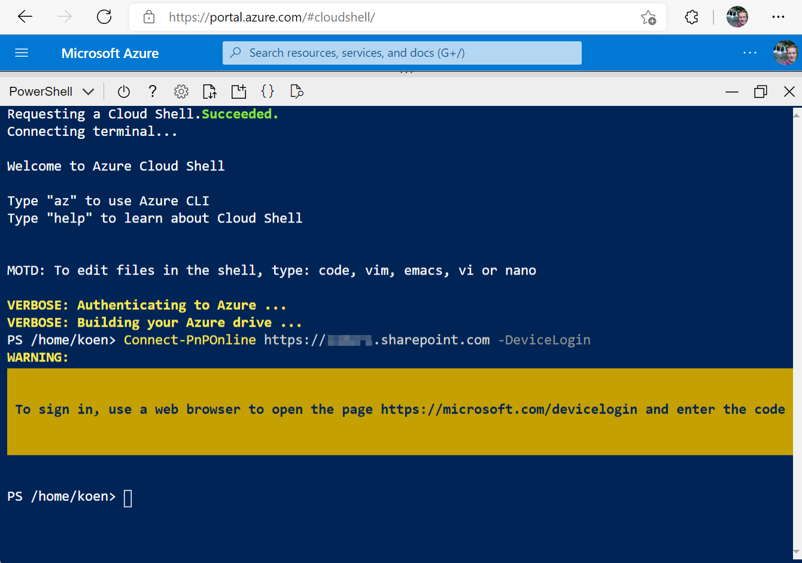

# Using PnP PowerShell in Azure Cloud Shell

In this article we will explain how to use PnP PowerShell inside [Azure Cloud Shell](https://learn.microsoft.com/en-us/azure/cloud-shell/overview). Using Azure Cloud Shell can come in handy in several scenarios. For example if policies on your local machine block you from installing PowerShell modules, you're behind a proxy which causes problems for your requests or you're on a shared machine which you don't want to pollute. With Azure Cloud Shell you open a PowerShell session which runs within Azure and outputs to you through i.e. a normal web browser via [shell.azure.com](https://shell.azure.com), [Windows Terminal](https://github.com/microsoft/terminal#welcome-to-the-windows-terminal-console-and-command-line-repo) or using any of the growing numbers of locations throughout the Microsoft products where the Azure Cloud Shell icon is visible (Microsoft 365 Admin Center, Teams Admin Center, Azure Portal, etc.).







## Requirements

You need to have access to an Azure Subscription. The usage of Azure Cloud Shell itself is free, however it requires an Azure File Share with Storage Account behind it to store files, which is billed against normal rates. A Visual Studio subscription with Azure Benefits is ideal to use for this.

## Set up Azure Cloud Shell

If you haven't used Azure Cloud Shell yet, follow these steps to get it going:

1. Open a web browser and go to https://shell.azure.com
1. Follow the steps on the screen. When asked to choose between Bash or PowerShell, choose PowerShell. When asked to create a new storage account, use the default or go for advanced if you wish to specify the names of the components yourself.

Once done, you should be seeing a blue PowerShell like environment running from your browser.



## Add PnP PowerShell to your Azure Cloud Shell

After completing the steps of the previous paragraph to get Azure Cloud Shell set up for your account, you can now add PnP PowerShell to your environment. You only need to do this once. Every time you return to Azure Cloud Shell, it will still have the module available to be used. You still have to manually update it to a newer version of PnP PowerShell, once one will be released, though, just like locally.

1. In the Azure Cloud Shell, on the prompt, enter 

   ```powershell
   Install-Module PnP.PowerShell -AllowPrerelease
   ```

   
   
1. If asked to confirm that you wish to install the module from an untrusted repository, respond with `Y`

## Connecting to your Microsoft 365 Environment from Azure Cloud Shell

Not every [available option within PnP PowerShell to authenticate](connecting.md) will work due to the Azure Cloud Shell not being able to show a visual login screen. Choose below how you will authenticate.

### By using Device Login

Using the Device Login option will allow you to use any browser session on any device to authenticate your Azure Cloud Shell connection attempt. Follow these steps to do so.

1. In Azure Cloud Shell, enter:

   ```powershell
   Connect-PnPOnline https://yourtenant.sharepoint.com -DeviceLogin
   ```

   
2. Open a web browser on any device and navigate to [https://microsoft.com/devicelogin](https://microsoft.com/devicelogin)
3. Type over or copy/paste the code shown in the yellow area of the Azure Cloud Shell

   

4. Log in with the account you wish to connect the Azure Cloud Shell with to your Microsoft 365 environment
5. Click on `Continue` to confirm you are logging on to the PnP Management Shell
6. You can now safely close the browser you have used to perform the device login
7. Return to the Azure Cloud Shell. If it shows the prompt again, you have successfully been signed in to your Microsoft 365 tenant and can now perform PnP PowerShell cmdlets like you're used to. 

   

> [!Important]
> There is one final important remark to make. When connecting using the `-DeviceLogin` option, PnP PowerShell cannot automatically switch to the `yourtenant-admin.sharepoint.com` context, meaning any cmdlets you try to run that require being connected to the admin portal, will need you to use `Connect-PnPOnline https://yourtenant-admin.sharepoint.com -DeviceLogin` yourself first to authenticate specifically to the admin site before you can use them.
