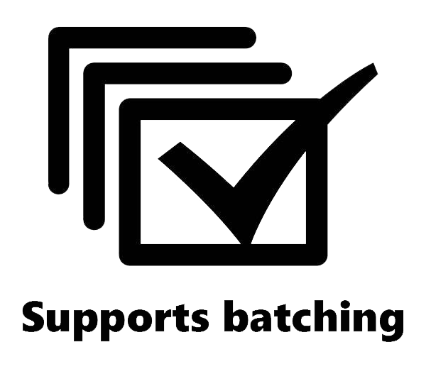

# Batching in PnP PowerShell

Some cmdlets support batching, but there are a few things to point out here. Let me first explain the difference between a normal request and a batched request.

## Adding items without batching (CSOM)

```powershell
1..100 | ForEach-Object{ Add-PnPListItem -List "ItemTest" -Values @{"Title" = "Test Item $_"} }
```

If you add a list item with Add-PnPListItem without batching, the following happens behind the scenes:

1. We retrieve the list and make sure we retrieve all the fields used in that list. (a least one request to the server but usually a few more CSOM requests)
1. We add a new item to the list
1. We loop through the values you specified to set on the item and depending on the type of field we format the value ready to be added to the item (this _can_ introduce additional CSOM requests in the case of taxonomy fields for instance)
1. We update the item (this will be a CSOM request to the server)

All in all you see we make around 6 requests, although the exact number depends a bit on what type of fields you are setting. So if you loop through 100 items, you get at least 600 requests.

## Adding a item with batching (REST)

```powershell
$batch = New-PnPBatch
1..100 | ForEach-Object{ Add-PnPListItem -List "ItemTest" -Values @{"Title"="Test Item Batched $_"} -Batch $batch }
Invoke-PnPBatch -Batch $batch
```

When you use batching, these number of requests are much lower. This is what happens when you use batching

1. We retrieve the list and make sure we retrieve all the fields used in that list. We then, and that's important, add that list to a cache _in_ the batch. That means that every subsequent request for the fields of that list will be coming from the cache.
1. We loop through the values you specified to set on the item. This most of the time does not cause any additional request, with the exception of taxonomy fields. Due to limitations of the REST apis available to use we have to fallback to a CSOM request to format the value.
1. We add the item with the new values to the list (creating a batched request)

This means that for every new item there is one request + a few initial request to retrieve the list.

Then when you execute `Invoke-Batch` we will check out how many items there are in the batch and will split them up accordingly to follow the request limits provided. You'll see that large batches are split up in chunks of 100 requests. This means that if you, say add 100 items, you will issue around 6 requests _in total_.

## Large batches and exceptions

Depending on the type of requests you are making batches can be split up in 'chunks'. For instance, if the tasks you perform are towards SharePoint and behind the scenes use the REST api of SharePoint a batch larger then 100 requests will be split up in chunks of 100 requests. When behind the scenes the Microsoft Graph is being called then the batch requests will be split up in chunks of 20 requests.

For instance, removing 520 list items will result in 6 separate requests, the first 5 containing 100 remove requests, the last one containing 20 remove requests.

If during one of these chunks an exception occurs (for instance you are trying to delete an item that does not exist), by default we will continue processing the remaining batch chunks. If you want to stop processing these remaining batches immediately after an exception occurs, use the `-StopOnException` switch on `Invoke-PnPBatch` cmdlet.

## Cmdlets that support batching

The following cmdlets support batching. (This support began with the 1.7.63-nightly release.) All cmdlets which support batching display the badge, linking to this article.



* [`Add-PnPListItem`](/powershell/cmdlets/Add-PnPListItem.html)
* [`Set-PnPListItem`](/powershell/cmdlets/Set-PnPListItem.html)
* [`Remove-PnPListItem`](/powershell/cmdlets/Remove-PnPListItem.html)
* [`Publish-PnPSyntexModel`](/powershell/cmdlets/Publish-PnPSyntexModel.html)
* [`Unpublish-PnPSyntexModel`](/powershell/cmdlets/Unpublish-PnPSyntexModel.html)
* [`Request-PnPSyntexClassifyAndExtract`](/powershell/cmdlets/Request-PnPSyntexClassifyAndExtract.html)
