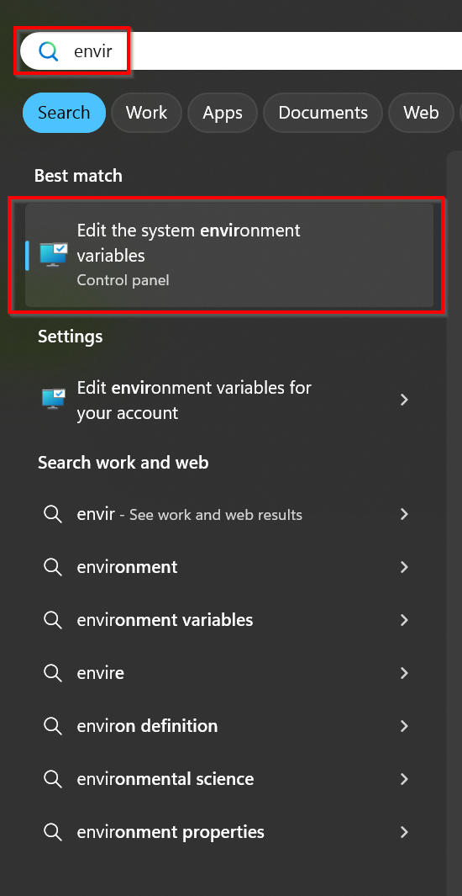
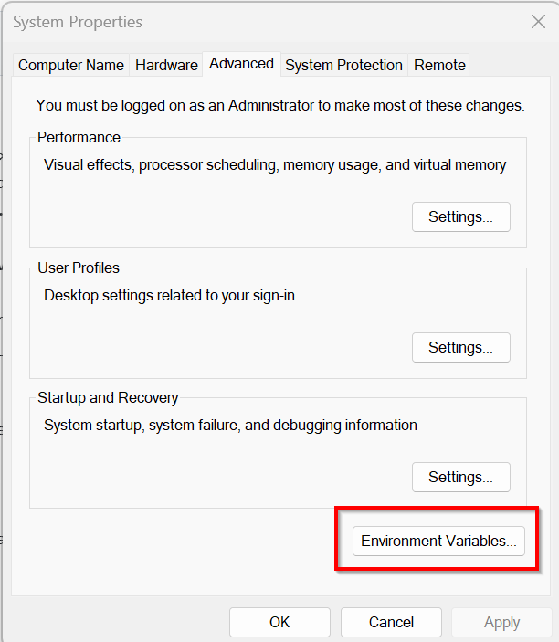
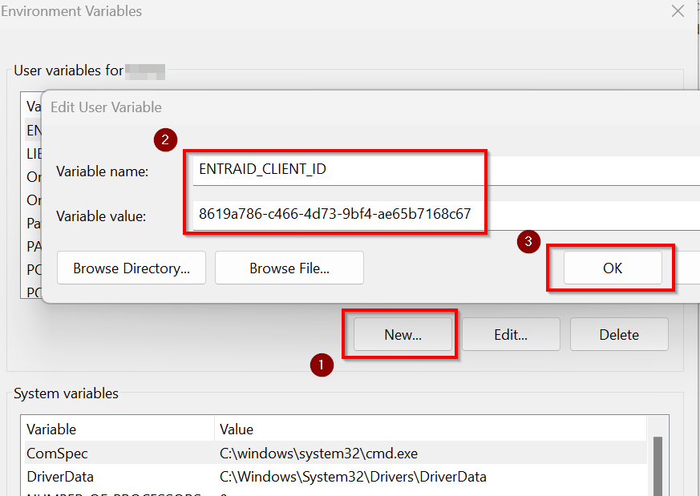

# Set a default Client ID

As of September 9<sup>th</sup>, 2024, it is no longer possible to use PnP PowerShell with `-Interactive` without [providing your own Entra ID App Registration](registerapplication.md) by passing in `-ClientId` as well. To avoid having to add `-ClientId` on every connect, you can also perform the below task to set the default ClientId for your environment. This avoids you having to update all of your scripts to include `-ClientId` in the Connect-PnPOnline statements, making the impact of this change smaller by not having to update existing scripts.

## By storing a client id for a tenant

> [!NOTE]
> This functionality is only available in the versions *newer* than 2.12.0

This options allows you to have different client ids for different tenant.

To set this use the `Set-PnPManagedAppId` cmdlet. You do not have to be connected to a tenant for this.

To set a client id for tenant with url `https://yourtenant.sharepoint.com`, you enter:

```powershell
Set-PnPManagedAppId -Url https://yourtenant.sharepoint.com -AppId f0e2b362-8973-4fc7-a293-3c73e2677e79
```

This will add an entry to your Windows Credential Manager or the MacOS keychain if your are on MacOS. Connect-PnPOnline will use this value to match the correct client id with the url you are connecting to and it is not needed use -ClientId anymore, e.g.

```powershell
Connect-PnPOnline -Url https://yourtenant.sharepoint.com -Interactive
```


You can manage entries using the `Get-PnPManagedAppId` and `Remove-PnPManagedAppId` cmdlets. Using these cmdlets it is possible to have different client/app ids for different tenants, which is usefull if you are a consultant serving multiple customers for instance.


## By setting an environment variable

You can set an environment variable on your machine or in your profile to default to the ClientId you configure in it. The name of the environment variable should be either: `ENTRAID_APP_ID`, or `ENTRAID_CLIENT_ID`, or `AZURE_CLIENT_ID`. You only need one of these, not all of them. They will be used in the order shown, i.e. if you set a value for `AZURE_CLIENT_ID` and another one for `ENTRAID_APP_ID`, the `ENTRAID_APP_ID` entry will be used and the other will be ignored.  

As the value for the environment variable, set the GUID of the Client Id / App Id from Entra ID of [your own App Registration](registerapplication.md).

### Steps for Windows using PowerShell

Simply run this line:

```powershell
[System.Environment]::SetEnvironmentVariable('ENTRAID_CLIENT_ID', '<client id of your Entra ID App Registration>', [EnvironmentVariableTarget]::User)
```

### Steps for Windows using the user interface

To create a persistent environment variable on a Windows machine, follow the below steps.

1. Open the Windows start menu and search for _Environment variables_ and click on _Edit the system environment variables_
   
   

1. Click on _Environment Variables_
   
   

1. Under _User variables for \<username\>_, click the _New_ button. As the _Variable name_, enter:

   ENTRAID_CLIENT_ID

   As the _Variable value_ enter the Client ID of your Entra ID application registration which you would like to use as the default for all Connect-PnPOnline executions.

   Close all open dialog boxes by clicking on _OK_
   
   
   
### Steps for Linux

To create a persistent environment variable on a Linux machine, follow the below steps.

1. Connect to your Linux machine

1. Execute:

   ```bash
   nano ~/.bashrc
   ```

1. Hit _CTRL+END_ to jump to the end of the file and add the line:

   ```
   export ENTRAID_CLIENT_ID=<client id of your Entra ID App Registration>
   ```

   

1. Hit _CTRL+X_, type _Y_ to save and close the file

1. Execute:

   ```bash
   source ~/.bashrc
   ```
   
   This will load the newly added system variable into the current session.

1. To validate that the environment variable is there, execute:

   ```bash
   echo $ENTRAID_CLIENT_ID
   ```

## Troubleshooting

In case you want to validate which ClientID is being used to connect, simply add `-Verbose` to your `Connect-PnPOnline` statement to see which ClientID is used to make the connection.


