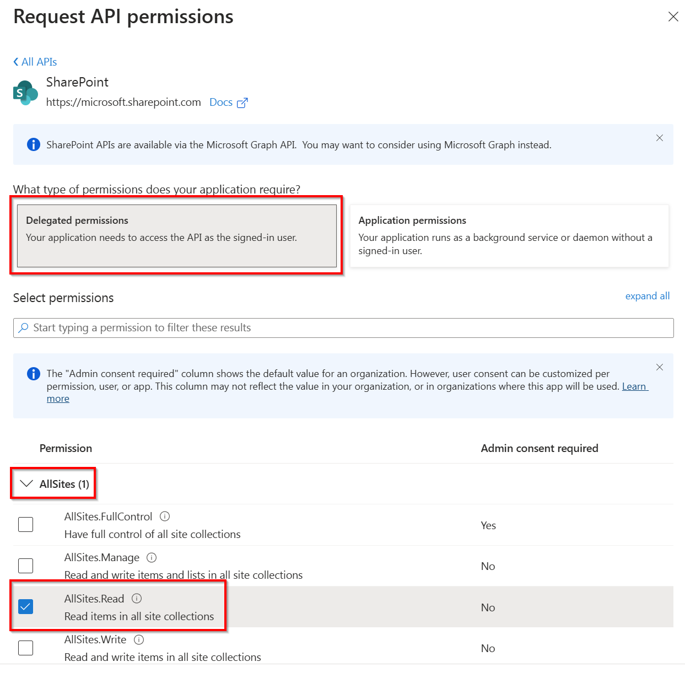
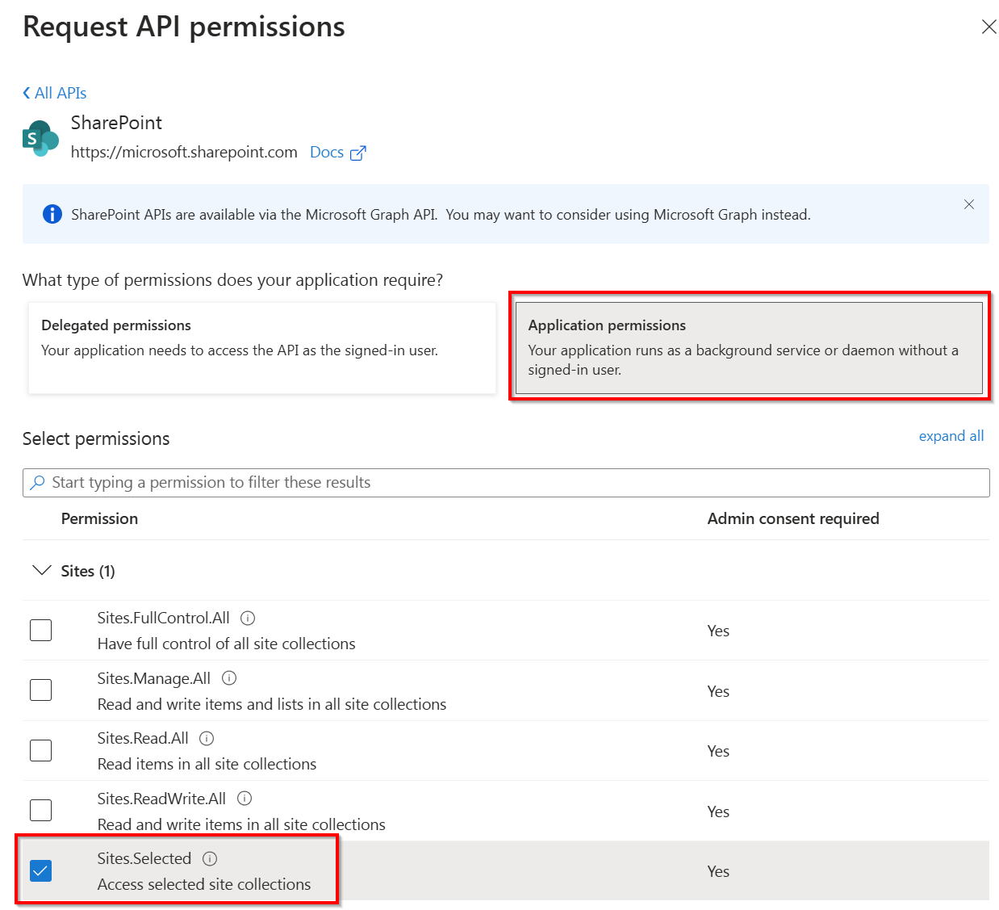
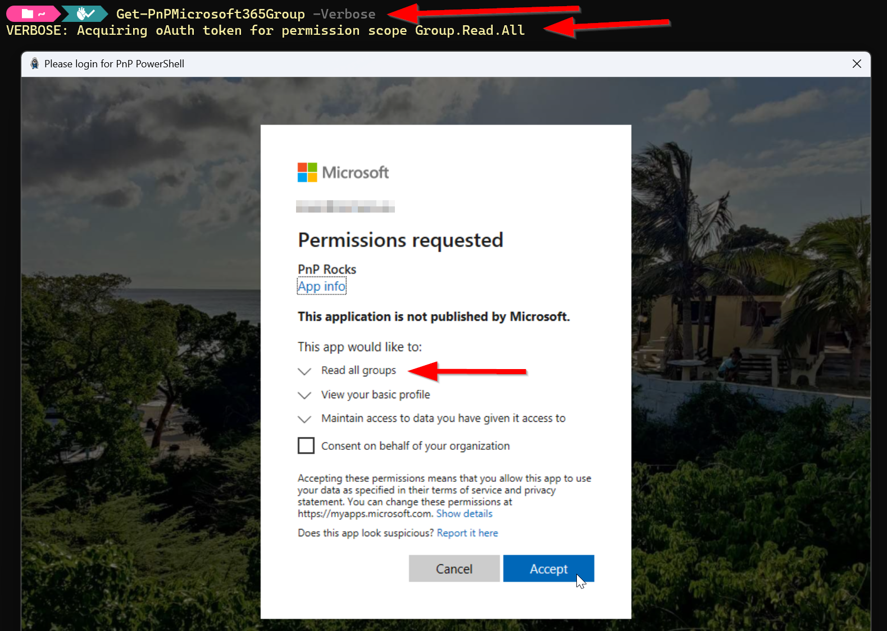
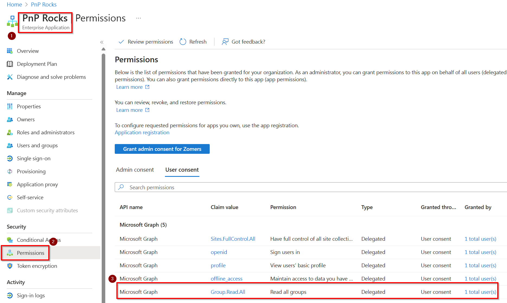
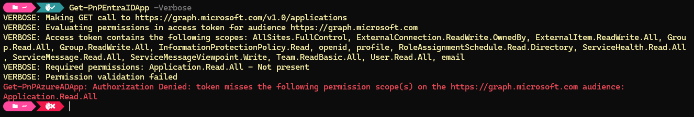

# How to determine which permissions you need

> [!NOTE]
> As of September 9<sup>th</sup>, 2024, it is [required to use your own Entra ID Application Registration](https://github.com/pnp/powershell/issues/4250) to use PnP PowerShell. This introduces the complexity of trying to determine the minimum set of permissions you will need to be able to execute your script. This article aims to help you in determining the permissions you need to set on your Entra ID Application Registration.

## Creating an Entra ID Application Registration

In case you're starting from the beginning and you do not have your own Entra ID Application Registration yet to use with PnP Powershell, which is mandatory, you can [follow these steps](registerapplication.md) to create your Entra ID Application Registration.

## Asking PnP PowerShell which permissions a cmdlet needs

Before working out permissions by trial and error, ask the module directly. [Get-PnPCommandPermission](../cmdlets/Get-PnPCommandPermission.md) returns the permissions a cmdlet needs. It reads the metadata that ships inside the module, so it works offline and does **not** require you to be connected to a tenant:

```powershell
Get-PnPCommandPermission -CommandName Get-PnPTeamsTeam
```

```
CommandName            : Get-PnPTeamsTeam
PermissionSource       : Declared
DelegatedPermissions   : Graph: Group.Read.All OR Graph: Group.ReadWrite.All
ApplicationPermissions : Graph: Group.Read.All OR Graph: Group.ReadWrite.All
ResourceTypes          : Graph
DelegatedAvailable     : True
ApplicationAvailable   : True
MinimumSharePointRole  : NotApplicable
```

Read the result as follows:

- Permissions **within one set** are all required together, they are combined with `AND`. Multiple sets are **alternatives**, combined with `OR`, and are listed from least to most privileged. In the example above, granting only `Group.Read.All` is enough.
- `MinimumSharePointRole` tells you which permission the *user or application* needs on the SharePoint resource itself, next to the API permission on the application registration. Granting `Sites.ReadWrite.All` does not help if the account has only Read on the target site.
- `DelegatedAvailable` and `ApplicationAvailable` tell you whether the cmdlet can be used at all in that scenario. A cmdlet with `ApplicationAvailable : False` cannot be run app only, no matter which permissions you grant.

### How reliable is the answer

Always check `PermissionSource`, it states how authoritative the answer is:

| PermissionSource | What it means |
| ---------------- | ------------- |
| `Declared` | The permissions are declared on the cmdlet itself. These are accurate. |
| `DeclaredAndInferred` | The cmdlet calls another API next to SharePoint. The declared part is accurate, the SharePoint part is an estimate. |
| `Inferred` | Derived from what the cmdlet does. A least privilege estimate that may need to be raised, and it covers the SharePoint API only. |
| `ResourceDependent` | The permission follows from what you point the cmdlet at, i.e. `New-PnPGraphSubscription` needs read permissions on the resource you subscribe to. The `Guidance` property links to the relevant documentation. |
| `NotApplicable` | The cmdlet needs no permissions at all, i.e. `Get-PnPChangeLog`. |
| `Unknown` | The permissions could not be determined. Fall back to the approach described further down this article. |

Anything other than `Declared` is guidance rather than a guarantee, so verify it against your own scenario.

### Working out the permissions for an entire script

The most useful application is composing the permission set for a script before you run it. Extract the PnP cmdlets it uses and ask for their permissions in one go:

```powershell
$cmdlets = [regex]::Matches((Get-Content ./myscript.ps1 -Raw), '\b[A-Z][a-zA-Z]+-PnP[A-Za-z0-9]+\b') |
    ForEach-Object { $_.Value } | Sort-Object -Unique

$cmdlets | Get-PnPCommandPermission |
    Format-Table CommandName, PermissionSource,
        @{ n = 'Application'; e = { ($_.ApplicationPermissions | ForEach-Object { $_.ToString() }) -join ' OR ' } }
```

```
CommandName       PermissionSource Application
-----------       ---------------- -----------
Add-PnPListItem           Inferred SharePoint: Sites.ReadWrite.All
Connect-PnPOnline    NotApplicable
Get-PnPList               Declared SharePoint: Sites.Selected OR SharePoint: Sites.Read.All OR …
Get-PnPTeamsTeam          Declared Graph: Group.Read.All OR Graph: Group.ReadWrite.All
Set-PnPWeb                Inferred SharePoint: Sites.FullControl.All
```

To get the actual list to grant, take the **least privileged alternative** of each cmdlet, which is the first set, and group it per API. This matches the order in which you add permissions in the Entra ID portal:

```powershell
$cmdlets | Get-PnPCommandPermission |
    Where-Object { $_.ApplicationPermissions.Count -gt 0 } |
    ForEach-Object { $_.ApplicationPermissions[0].Permissions } |
    Group-Object ResourceType |
    ForEach-Object { "{0}: {1}" -f $_.Name, (($_.Group.Scope | Sort-Object -Unique) -join ', ') }
```

```
Graph: Group.Read.All
SharePoint: Sites.FullControl.All, Sites.ReadWrite.All, Sites.Selected
```

Where several SharePoint scopes appear, the most privileged one covers the others, so in this example `Sites.FullControl.All` is what the script ends up needing. That immediately shows you which single cmdlet is driving the permission up, in this case `Set-PnPWeb`. If you can avoid that cmdlet, the whole script drops to `Sites.ReadWrite.All`.

Use `-Source` to review only the answers that are estimates and therefore worth verifying:

```powershell
$cmdlets | Get-PnPCommandPermission | Where-Object PermissionSource -ne 'Declared'
```

### Other useful queries

```powershell
# Every cmdlet that touches Microsoft Graph, with authoritative metadata only
Get-PnPCommandPermission -ResourceTypeName Graph -Source Declared

# Every Teams related cmdlet
Get-PnPCommandPermission -CommandName *Teams*

# Which cmdlets require SharePoint administrator rights
Get-PnPCommandPermission | Where-Object MinimumSharePointRole -eq 'SharePointAdministrator'

# Which cmdlets cannot be used app only
Get-PnPCommandPermission | Where-Object { -not $_.ApplicationAvailable }
```

The rest of this article describes how to apply these permissions to your application registration, starting from the smallest possible set.

## Starting with minimal permissions

It is highly recommended to keep the permissions on your Entra ID Application Registration to a minimum to avoid risks when access through your application registration would somehow fall in the wrong hands. As PnP PowerShell always starts with connecting to SharePoint Online, you will at least need permissions to access SharePoint Online, regardless of whatever else you plan on doing with PnP PowerShell.

### When using a delegate login

A delegate login means you will be interactively logging in to your tenant using PnP PowerShell by providing your credentials. There are [several ways](authentication.md) of connecting in this way. Always remember that in this scenario, regardless of which permissions you assign to your Entra ID Application Registration, the user logging in through PnP PowerShell _must_ also have the permissions for whatever the user is trying to do. I.e. if you would assign `AllSites.FullControl` permissions on your application registration, the user still can only access those SharePoint Online sites to which the user has been granted permissions directly to that site as well and will only have those permissions assigned to it (i.e. read or write).

The lowest permission you can set on a delegate login will be `AllSites.Read` on the delegate scope of SharePoint:



### When using an app only context

An app only context is being used when your intend is to run a script that does not require any user intervention to connect and authenticate to your tenant. There are [several ways](authentication.md) of connecting in this way. In this scenario, exactly those permissions you assign to your Entra ID Application Registration are the ones the script that runs will have. Therefore, be extra careful in this scenario not to set too high permissions.

The lowest permission you can set on an app only scenario will be `Sites.Selected` on the application scope of SharePoint:



When using the `Sites.Selected` permission, you still must assign permissions to one or more sites where the script will have access to. Ensure you will assign at least `Read` permissions on the site of which you will use the URL in your `Connect-PnPOnline <url>` statement in your script. You can easily do so by utilizing the PnP PowerShell cmdlet [Grant-PnPAzureADAppSitePermission](../cmdlets/Grant-PnPAzureADAppSitePermission.md) as shown here:

```powershell
Grant-PnPAzureADAppSitePermission -AppId "<Client ID of your Entra ID applicarion registration>" -DisplayName "PnP PowerShell" -Permissions Read -Site <url of the SharePoint Online site to which you will connect>
```

In order to be able to run this cmdlet, you will need to connect to PnP PowerShell using preferably another Entra ID application registration which will have the `AllSites.FullControl` permission on the delegate scope on SharePoint set to it and being logged on with a Global Administrator or SharePoint Administrator privileged account.

## Adding additional permissions as needed

Once you've se the minimum permissions as described above, you can go ahead and test using your Entra ID application registration to connect to SharePoint Online using [one of the available connect options](authentication.md). You can add `-ValidateConnection -Verbose` to your `Connect-PnPOnline` cmdlet to instruct it to test the connection once established.

Now you likely want to perform more than just a simple read using PnP PowerShell. Read on below to find out what you can do to find out about the additional permissions your application registration might need to operate correctly.

### When using a delegate login

When planning to use your app registration for delegates, you could opt for simply starting to use it. Once you execute a cmdlet that requires more permissions, a dialog will pop up asking you to consent to these additional permissions being assigned to the application registration. An example of this is shown on the following screenshot:



What technically happens here when you provide consent through this dialog is that in the Entra ID Enterprise Application connected to your Entra ID application registration, the permission gets added. This means that on subsequent requests of this cmdlet using this client id, even in new sessions, these permissions will then be granted already. You can visualize this by going to [Entra ID](https://entra.microsoft.com) > Identity > Applications > Enterprise applications and looking for the registration with the same name as your Entra ID application registration. Once found, open it, in the menu click on _Permissions_, go to the _User consent_ tab and look at the assigned permissions:



### When using an app only context

For an app only scenario, you will have to follow a different approach, as there is no way for it to interactively request for more permissions. If you try to execute a cmdlet for which the Entra ID application registration does not have permissions, it will return you an access denied notice.

The quickest way to find out what to add is to run [Get-PnPCommandPermission](../cmdlets/Get-PnPCommandPermission.md) against the cmdlet that failed, as described [earlier in this article](#asking-pnp-powershell-which-permissions-a-cmdlet-needs). It requires no connection, so you can run it before ever hitting the access denied.

Alternatively you can add `-Verbose` to your cmdlet. For many, but unfortunately not all, cmdlets, this will reveal which permissions it receives through the application registration and which permissions it actually needs to be able to execute properly. See the following example:



In this scenario, you now know you need to add `Application.Read.All` on the applications scope of Microsoft Graph in your application registration in order to give it sufficient rights to execute this cmdlet.

## Help, I can't figure out which permissions I need

First run [Get-PnPCommandPermission](../cmdlets/Get-PnPCommandPermission.md) against the cmdlet, as described [earlier in this article](#asking-pnp-powershell-which-permissions-a-cmdlet-needs). It has an answer for nearly every cmdlet in the module.

If it returns a `PermissionSource` of `Unknown`, or an `Inferred` answer that turns out not to be sufficient, use the table below for guidance on a minimum permissions approach.

What are you trying to do | Permission type | Permission(s) likely needed from least to most privileged 
| ------------------------| --------------- | -------------------------- |
| Interact with SharePoint | Delegate | AllSites.Read / AllSites.Write / AllSites.Manage / AllSites.FullControl |
| Interact with SharePoint | App Only | Sites.Selected / Sites.Read.All / Sites.ReadWrite.All / Sites.Manage.All / Sites.FullControl .All |
| Interact with Microsoft Graph | Delegate \ App Only | Use `Get-PnPCommandPermission -CommandName <cmdlet>`, `-Verbose`, or look at [the documentation](../cmdlets/index.md) to find the permissions needed |
| Interact with Power Platform | Delegate | `Azure Service Management\user_impersonation` AND `Dynamics CRM\user_impersonation` AND `PowerApps Service\User` (the last one you can find on the second tab: APIs that my organization uses) |
