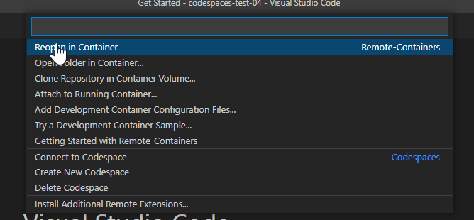
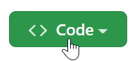
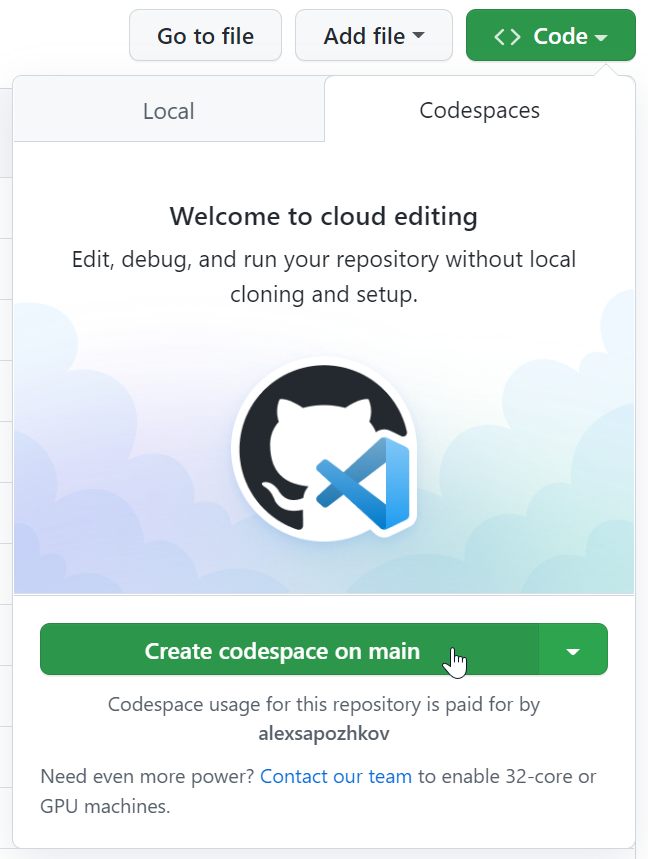

# Using PnP.PowerShell in Visual Studio Development Containers

Visual Studio Code development containers allows you to work with PnP.PowerShell commands in containers that Visual Studio will run automatically for you so you don't need to care running `docker run`. In this way it is also easier to make sure that all members of the project are using the same development environment, with the same versions of the prerequisites installed.


If you want to learn more about this Visual Studio Code feature, you can start [here](https://code.visualstudio.com/docs/devcontainers/containers).

## Prerequisites

There might be two options of using Visual Studio Code development containers with PnP.PowerShell:

- Using locally installed Docker, on your desktop/laptop.
- Running containers in cloud using GitHub CodeSpaces (requires a paid GitHub plan)

When you run in a development container in GitHub CodeSpaces, you do NOT need to install any version of the PnP.PowerShell directly on your laptop/desktop.

What you will need locally is only Visual Studio Code!

### Locally Installed Docker

For using that option you need to have locally installed the following software:

- Visual Studio Code
- [Visual Studio Code extension, Remote - Containers](https://marketplace.visualstudio.com/items?itemName=ms-vscode-remote.remote-containers)
- Docker Engine. Kindly use [`Installing Docker locally` section of the `Using PnP PowerShell in Docker containers` article](dev-containers.md) for installation instructions.

### GitHub CodeSpaces

This option requires the following:

- Git repository in a [GitHub organization with enabled CodeSpaces](https://docs.github.com/en/codespaces/managing-codespaces-for-your-organization/enabling-github-codespaces-for-your-organization)

## Defining Development Containers for the Project

1. In the root folder of the source code, create the folder called `.devcontainer`.

2. In this folder, create the `devcontainer.json` file with the following contents:

```json
{
	"name": "PnP 1.11.0",
	"image": "m365pnp/powershell:1.11.0-alpine-3.16.5",
	"customizations": {
		"vscode": {
			"settings": {
				"terminal.integrated.defaultProfile.linux": "pwsh"
			},
			"extensions": [
				"ms-vscode.powershell"
			]
		}
	},
	"extensions": [
		"editorconfig.editorconfig",
		"dbaeumer.vscode-eslint",
		"ms-vscode.PowerShell"
	],
	"postCreateCommand": "apk add git; git config --global --add safe.directory /workspaces"
}
```

## Starting working with PnP.PowerShell when you run Docker locally

1. Open the folder in Visual Studio Code
2. Click in the bottom left corner:


3. Select `Reopen in Container`:



4. Open a new Visual Studio terminal and run `Connect-PnPOnline -Url https://<your-tenant-name>.sharepoint.com`

The command should work even if you don't have PnP.PowerShell module installed locally on your laptop.

## Starting working with PnP.PowerShell when you run containers remotely in GitHub CodeSpaces

1. Open the project in GitHub site.
2. Click `Code` button:



3. Click `Create codespace on ...` button:



4. Run `Connect-PnPOnline -Url https://<your-tenant-name>.sharepoint.com` in the Visual Studio Code terminal

The command should work even if you don't have PnP.PowerShell module installed locally on your laptop.
