# Contribution guidance

Sharing is caring! All contributions to this repository are very welcome. This guidance should help you getting started contributing to PnP PowerShell by just following some easy steps.

There are various ways to accomplish the same goal. We'll go through a process here that should be easy to follow and accomplish for anyone. If you prefer using other tools over the ones mentioned here, such as using the cloning feature within Visual Studio, of course, feel free to use that instead.

## Getting started

Follow the paragraphs below to get yourself started with contributing to PnP PowerShell.

## Installing Git Tools

We'll be using the command line Git Tools to complete the steps. If you prefer using other tools, such as Visual Studio or the desktop client of Git, feel free to use that instead.

1. If you haven't got them already, install the Git Tools for your environment. They're available for Windows, Linux and Mac. Simply download the latest installer from: https://git-scm.com/downloads

   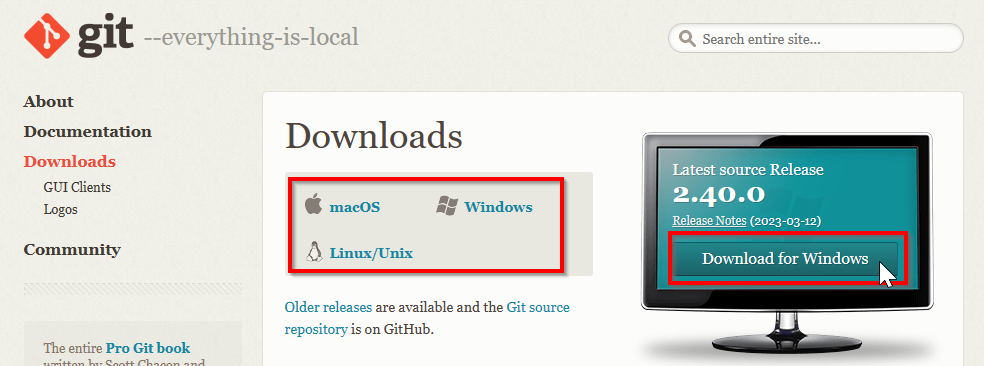

   And click on the **Click here to download** link

   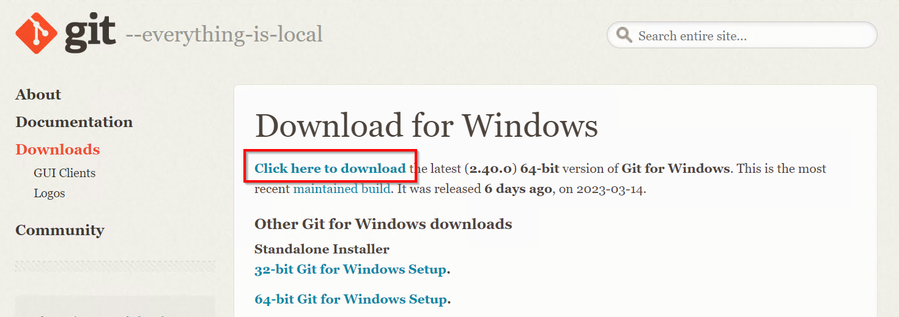

2. There will be a scary amount of questions asked during the installer. Just use all defaults and next-next-finish through the installation process
   
   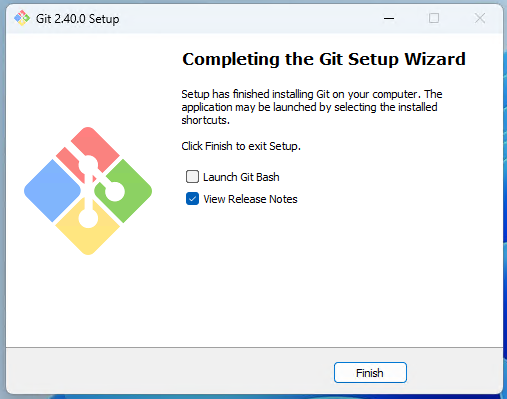

## Installing PowerShell 7

PnP PowerShell only runs on PowerShell 7. If you don't have it installed yet, follow the steps below to install it. If you already have it installed, you can skip to the next paragraph.

1. Navigate to the [PowerShell 7 download page](https://learn.microsoft.com/en-us/powershell/scripting/install/installing-powershell) and download the latest version of PowerShell 7. It is available for Windows, Linux and Mac.

   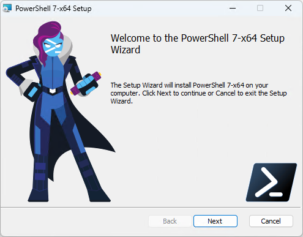

1. You can accept all the defaults and just do a next-next-finish installation.

   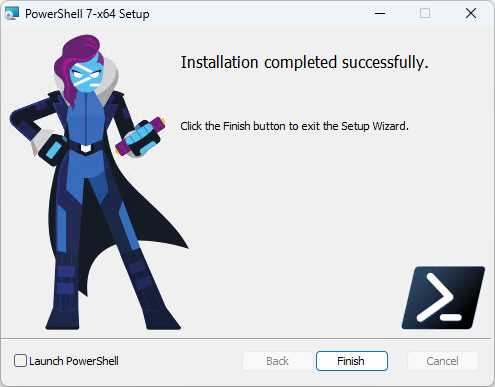

## Installing the .NET SDK 6

To be able to compile the PnP PowerShell code, you need to have the .NET SDK 6 installed. If you don't have it installed yet, follow the steps below to install it. If you already have it installed, you can skip to the next paragraph.

1. Navigate to the [.NET SDK 6 download page](https://dotnet.microsoft.com/download/dotnet/6.0) and download the latest version of the .NET SDK 6. It is available for Windows, Linux and Mac.

   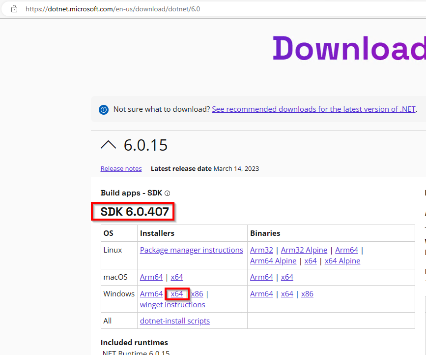

1. You can accept all the defaults and just do a next-next-finish installation.

## Create your own Fork

To contribute to a GitHub project, what you do first, is create a thing called a fork. Basically it means you will get your own copy of the sourcecode. To do so, follow the steps below.

1. Go to the [PnP PowerShell repository](https://github.com/pnp/powershell) on GitHub

1. Make sure you're logged on to GitHub. If you dont have a GitHub account yet, create one and log on first before you continue.

1. Click the **Fork** button in the top right corner of the page or use this [direct link](https://github.com/pnp/powershell/fork) instead
   
   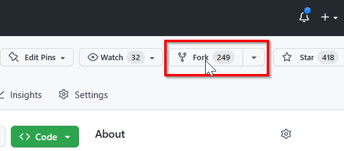

1. If it shows you a notice like this, you already have a fork. Continue with the next paragraph.

   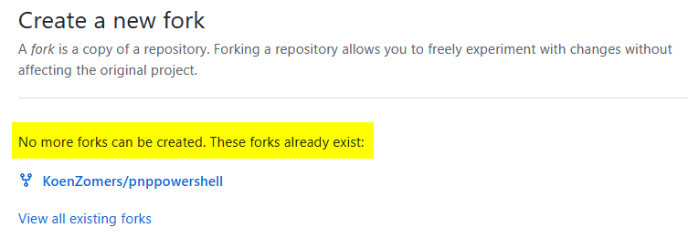

   If it instead shows something like this, click on **Create fork** to create your own fork. You can leave all the defaults.

   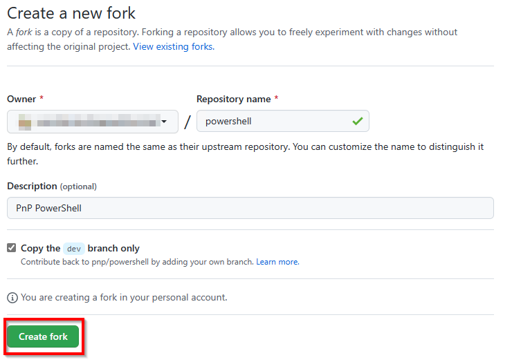

   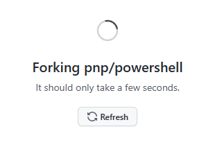

## Updating your Fork

Now that you have your own fork, you need to make sure it's up to date with the latest changes from the main repository. Do this every time before you start working on a change. If you don't do so, it will become much harder for us to review and merge your changes. To update your fork, follow the steps below.

1. First identify if your fork is already up to date. If it is, it will show you a message like this and you're good to continue with the next paragraph.

  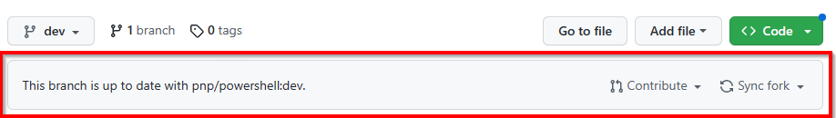

  If it instead shows something like this, showing that you're a certain amount of commits behind on pnp:dev, you need to update your fork first by continueing with the next step.

  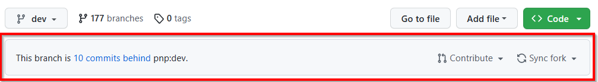

  Click on the **Sync fork** button and in the flyout that appears click on **Update branch**

  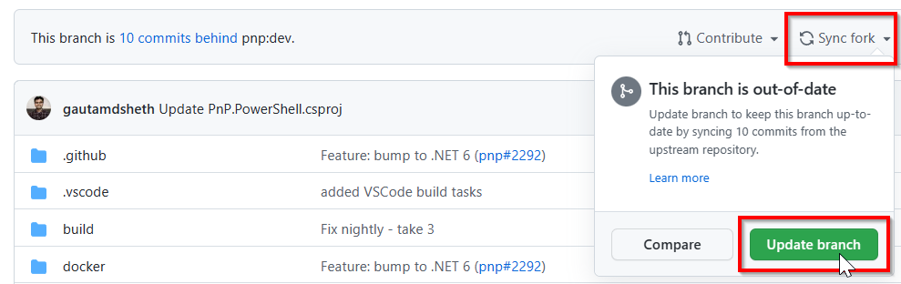

1. It should now show the above message that your branch is up to date. You can now continue with the next paragraph.
   If it instead shows that you're a certain number of comits ahead, it means your dev branch got polluted by changes you have pushed to it and you need to reset it first. Read up under (Troubleshooting)[#my-local-fork-is-ahead-of-pnpdev] for more information on how to resolve this situation.

## Cloning the repository to your local file system

The next step is to download, or clone, your copy/fork of the repository to your local machine so you can work on updating it. Follow these steps to do so.

1. Open a command prompt or PowerShell window and navigate to the folder where you want to clone the repository to. For example, if you want to clone it to your `C:\Source` folder, you would do the following:

  ```powershell
  cd C:\Source
  ```

1. Look up the URL of your fork. You can find it by clicking on the **Code** button on your forked repository on GitHub
   
   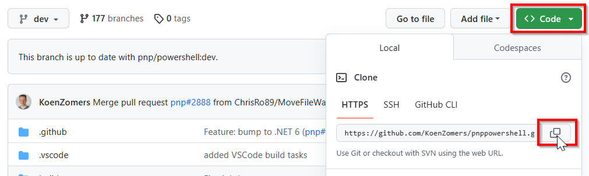

1. In the command prompt or PowerShell window, type the following command and replace the URL with the URL of your fork:

   ```powershell
   git clone <URL of repository>
   ```

   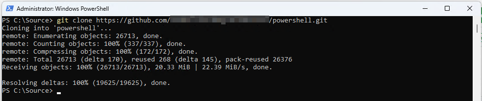

   It may be that it asks you to log on to GitHub. If so, do so and it will continue with the clone.

1. You should now have a copy of the PnP PowerShell code on your local machine in the subfolder named similarly to your fork name, typically `powershell`. If you want to read up on an explanation what each of these folders are for, read the [folder structure](./buildingfolderstructure.md) article.

   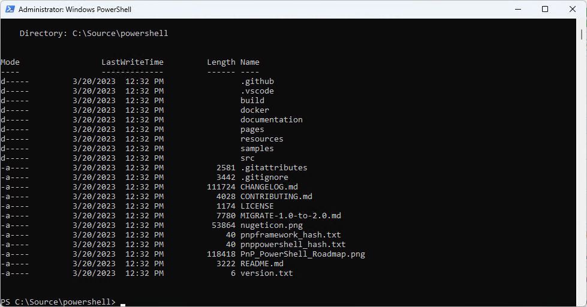

1. Add a reference to the upstream repository. This will allow you to pull in changes from the main repository to your local copy. To do so, type the command below. This time you can execute it exactly as shown here, you don't need to replace it with the URL of your own repository.

   ```powershell
   git remote add upstream https://github.com/pnp/powershell.git
   ```

   You can validate if the upstream has been added successfully by executing:

   ```powershell
   git remote -v
   ```

   If it shows entries for upstream, it worked.

   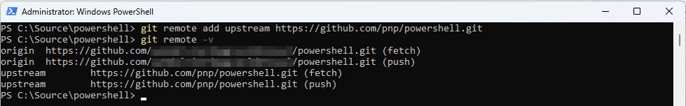

## Making changes to the code

You are now ready to start making changes to the code! Use your favorite code editor to make changes to the code. If you don't have a favorite code editor yet, we recommend you use [Visual Studio Code](https://code.visualstudio.com/). It's free, open source and cross platform. It's also the editor some of us use ourselves. You can also use the full version of Visual Studio. The next steps will assume Visual Studio Code has been installed and will be used.

1. Open Visual Studio Code and using the **File** menu go to **Open Folder...**

   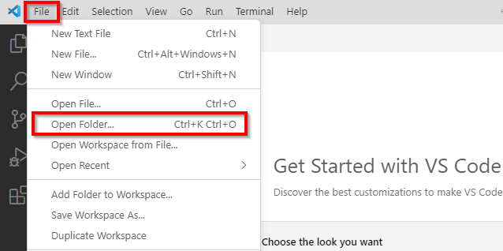

1. Navigate to the folder where you cloned the repository to and select the folder named `powershell`. Click **Select Folder** to open the folder in Visual Studio Code.

   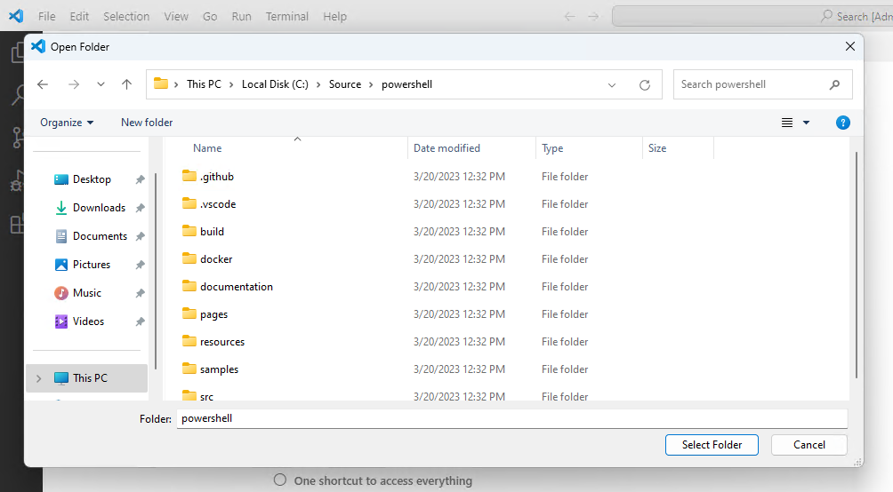

1. If a dialog pops up asking if you trust the authors of the files in the folder, click **Yes, I trust the authors**.

   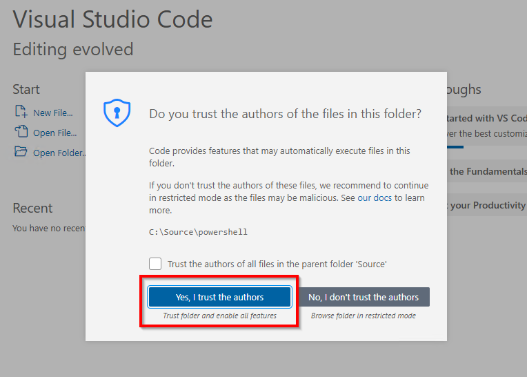

1. Before starting to make changes, to avoid polution your dev branch as it needs to stay up to date with the PnP PowerShell dev branch, create a new branch for your changes. To do so, click on **dev** at the bottom left and in the flyout menu that appears on the top, click on **Create new branch...**

   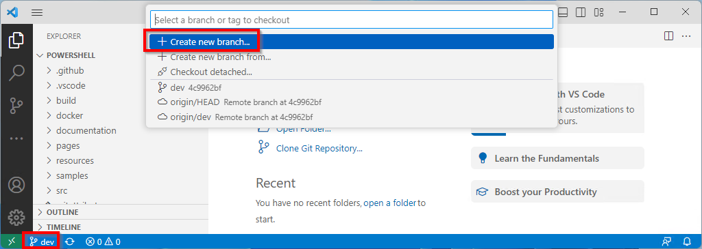

1. Enter any name for the new branch you would like. It helps giving it a distinctive name that makes it easy to identify the changes you're making. For example, if you're going to be working on a new cmdlet which allows to retrieve sites, you could name it `RetrieveFilesCmdlet`. Hit enter to create the new branch.

   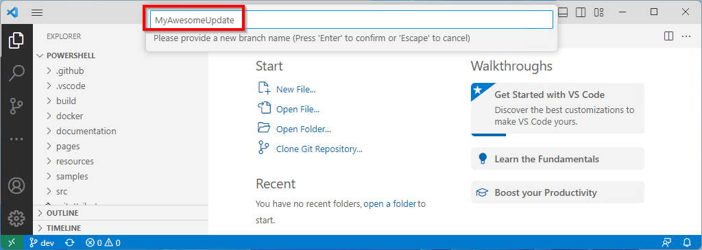

1. At the bottom left of Visual Studio Code, it should now show the new branch name you have created. You're now good to go and start making your changes to the code. Once you're done making your changes, proceed with the next paragraph on how to test your changes.

   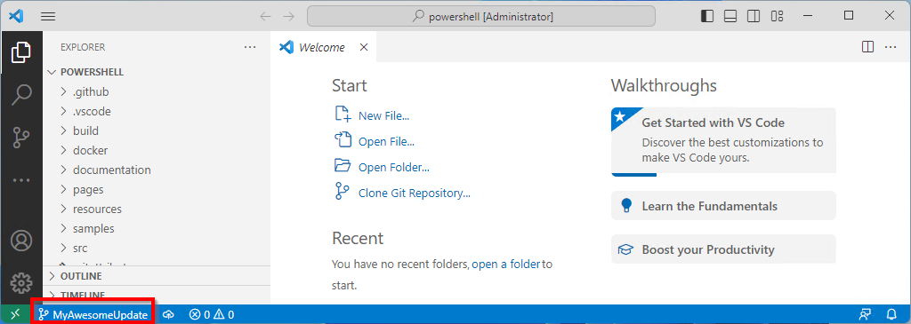

Some hints on how to work with Visual Studio Code to find the files in PnP PowerShell more easily:

- Use `CTRL+P` to easily search for existing files. If you're looking for an existing cmdlet to update, you can type its name without -PnP to find it easily. I.e. for `Get-PnPSite`, type  `GetSite` and it will show you the file where the cmdlet is defined. You can then open that file by hitting enter and make your changes.

  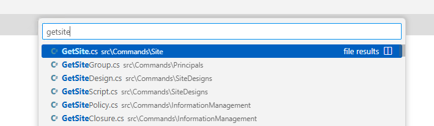

- You can also use `CTRL+P` to easily search for existing documentation on cmdlets. This time you will enter the full cmdlet name to find the documentation. I.e. for `Get-PnPSite`, type  `Get-PnPSite` and it will show you the file where the documentation for the cmdlet is defined. You can then open that file by hitting enter and make your changes.

  

- Its easier to copy than to reinvent! If you're going to add a new cmdlet, look for one that does something close to what you want to do and make a copy of it to function as a starter. You can then rename the cmdlet and update the code to do what you want it to do.

- Please only submit one (type of) change per pull request. If you want to submit multiple changes, please submit them as separate pull requests. This makes it easier for us to review, understand and merge your changes.

## Testing your changes

If you have only updated documentation, so called .md files, there's no need to test your changes. Just read up on your changes once more to ensure there are no typos. If you have updated code, you need to test your changes to make sure they work as expected. To do so, you need to build the code and then test your changes. Follow these steps to do so.

1. Ensure you do not have any PowerShell window open on your machine in which you have loaded PnP PowerShell. If you do, close them all before proceeding.

1. In Visual Studio Code, hit `CTRL+SHIFT+B` to open the build menu. In the menu that appears on the top, choose the option **Build with nugets**.

   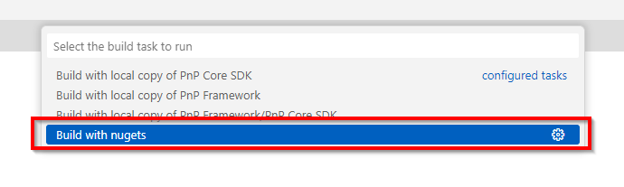

1. In the terminal window that appears at the bottom, you should see the build process start. It might take a few minutes to complete. Once it's done, you should see a message that the build succeeded. Be sure that it shows **Build succeeded** and no errors around copying the files to your local PowerShell modules folder.

   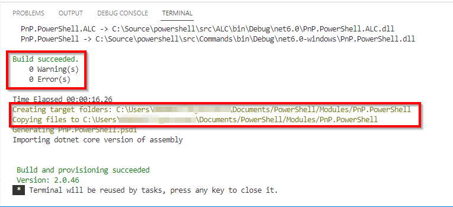

   If it instead shows error like the one below, it means you still have a PowerShell session open somewhere your machine which has PnP PowerShell loaded and which blocks the build process to update the files. It can be frustrating at times to find the PowerShell session that is blocking the build process. If you're not sure which session is blocking the build process, you can try to close all PowerShell sessions and try again. If that doesn't work, you can try restarting Visual Studio Code.

   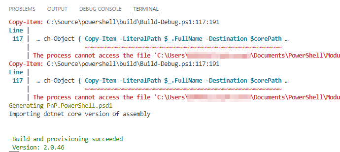

1. You can now use PnP PowerShell as normal, but this time it will use your own build instead of the official PnP PowerShell build. To test your changes, you can use the cmdlets you have created or updated. Ensure you will use a PowerShell 7 session and not a PowerShell 5 session.

   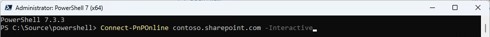

1. If you wish to step through your code debugging it, in your PowerShell 7 window, type the following command to reveal the process ID it runs under:

   ```powershell
   $PID
   ```

   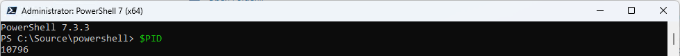

1. Back in Visual Studio Code, hit `F5`

1. If it asks you to install the `coreclr` component, click **Cancel** as it won't work like this. If it doesn't show this dialog, you can skip this step.

   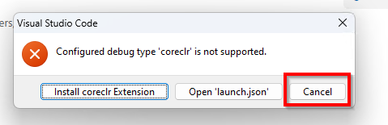

   Instead go to the extensions tab on the left in Visual Studio, use the search box to search for `c#`, click on the result that states **C# for Visual Studio Code (powered by OmniSharp)** and then click **Install**. Hit `F5` again once its done installing to proceed.

   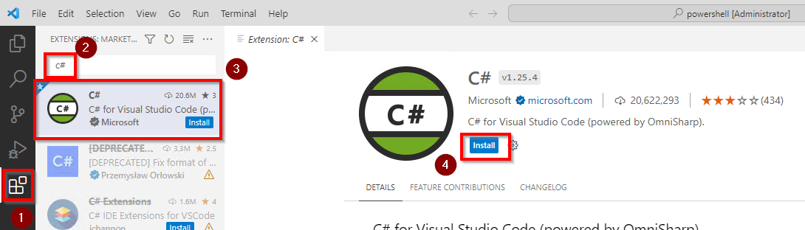

1. In Visual Studio Code, at the top a flyout menu should appear with the currently running processes on your machine. Start typing in the process ID you revealed in the step above and select the process that matches your PowerShell 7 session.

   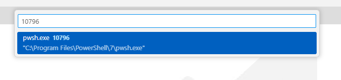

1. You can now set breakpoints as you are used to in your code and use the PowerShell 7 session you connected to to run the cmdlet and hit the breakpoints you have set.

    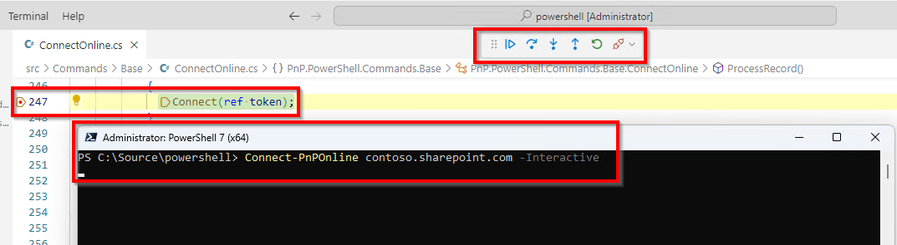

## Submitting your changes for review

Once you're done making and testing your changes, you need to submit them for review and submission in what we call a Pull Request, or PR in short. Follow these steps to do so.

1. Within Visual Studio Code, go to the Source Control section on the left. You will see all of the changes you have made. Once again, ensure with the branch name at the bottom, in this case `MyAwesomeUpdate` that you are working off of your own branch and not the dev branch. Enter a meaningful commit message in which you very briefly describe what you have changed. Then click the **Commit** button to commit your changes.

   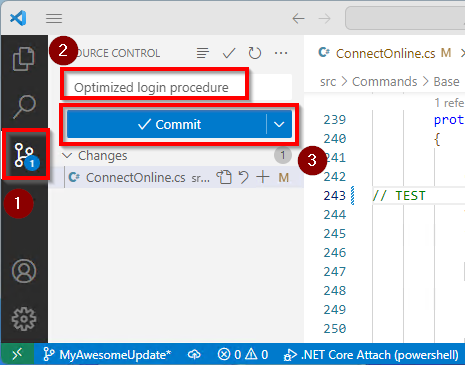

1. If Visual Studio Code shows a dialog mentioning that there are no staged changes to commit, just proceed by clicking **Yes** or **Always** based on your personal preference.

   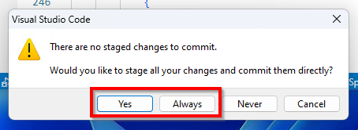

1. If Visual Studio Code shows a dialog mentioning `Make sure you configure your "user.name" and "user.email" in git.`, click **Cancel** and open a PowerShell 7 window and execute the following commands, replacing the values with your information:

    ```powershell
    git config --global user.name "John Doe"
    git config --global user.email "johndoe@outlook.com"
    ```

    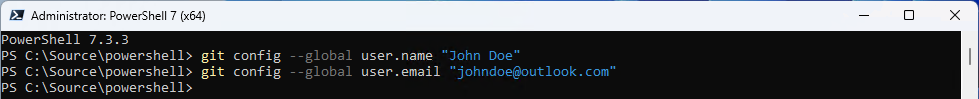

    Once done, go back to Visual Studio Code and click **Commit** again.

1. Now click the **Publish Branch** option that should appear under the Source Control section of Visual Studio Code to push your branch to GitHub.

   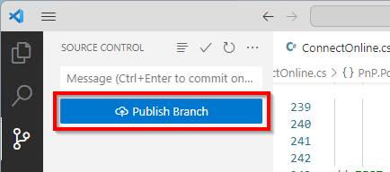

1. If it asks for the remote to publish it to, pick **Origin**.

   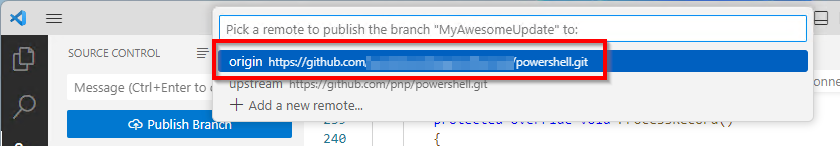

1. Open your browser and go to the [PnP PowerShell repository on GitHub](https://github.com/pnp/powershell). You should see a message that you have pushed a new branch to your fork. Click the **Compare & pull request** button to proceed.

   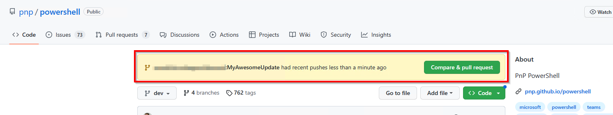

1. Provide a meaningful title for your pull request and a description that explains what you have changed and why. Then click the **Create pull request** button. Please ensure you leave the **Allow edits from maintainers** option checked so we can provide you with feedback on your pull request.

   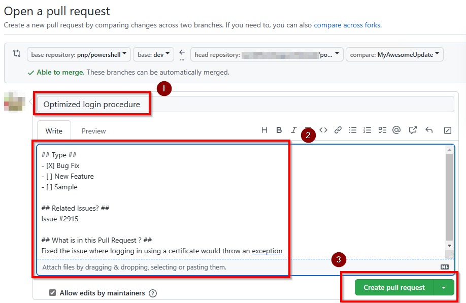

1. Your pull request has now been created! Please be patient while someone from the PnP PowerShell team will review your suggested changes and potentially provide you with feedback. This may take some time, as all of us are doing this in our spare time.

   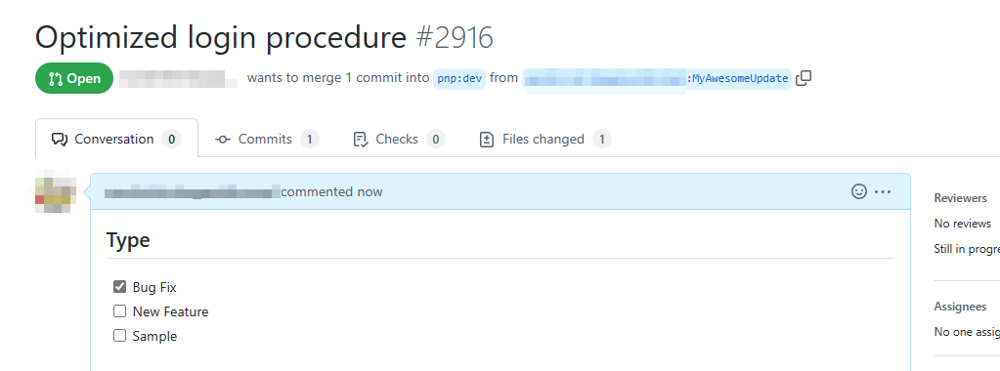

Thanks for contributing!

## Troubleshooting

### My local fork is ahead of pnp:dev

1. First proceed with the steps in the [Cloning the repository to your local file system](#cloning-the-repository-to-your-local-file-system) section to make sure you have a local copy of your version of the code.

1. After you've set up a local copy of the code, in a command prompt or PowerShell window, navigate to the folder where you cloned the repository to and execute the following command:

    ```powershell
    git fetch upstream
    ```

   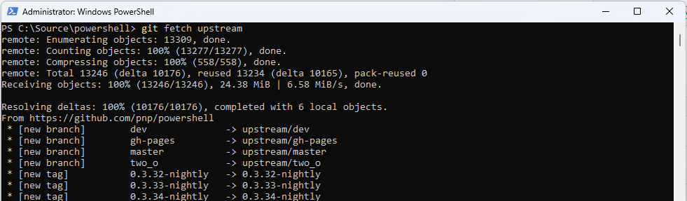

1. Now execute the following command to reset your local dev branch to the upstream dev branch:

    ```powershell
    git fetch upstream
    git checkout dev
    git reset --hard upstream/dev
    git push origin dev --force 
    ```

   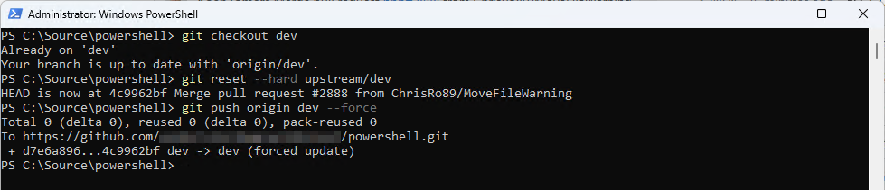

1. If you now return to GitHub in your webbrowser into your own fork, it should show that your dev branch is up to date with the upstream dev branch.

   

### How do I build against a local version of PnP Core and/or PnP Framework?

If your change also requires updates to PnP Core and/or PnP Framework, you need to build PnP PowerShell against your locally built version of PnP Core and/or PnP Framework. To do so, follow the steps in [this article](buildinglocalpnpbuild.md). If your changes just require updates to PnP PowerShell, you don't need to do this and can just follow the steps outlined on this page.

### Visual Studio Code shows a dialog mentioning `Make sure you configure your "user.name" and "user.email" in git.`

If Visual Studio Code shows a dialog mentioning `Make sure you configure your "user.name" and "user.email" in git.`, click **Cancel** in that dialog and open a PowerShell 7 window and execute the following commands, replacing the values with your information:

```powershell
git config --global user.name "John Doe"
git config --global user.email "johndoe@outlook.com"
```


You only need to do this once on your machine.

### Visual Studio shows a dialog asking to install the `coreclr` component

If Visual Studio Code asks you to install the `coreclr` component, click **Cancel** as it won't work trying to install from that dialog.


Instead go to the extensions tab on the left in Visual Studio, use the search box to search for `c#`, click on the result that states **C# for Visual Studio Code (powered by OmniSharp)** and then click **Install**.


### How do I know the process ID to attach to for debugging?

If you wish to step through your code debugging it, in your PowerShell 7 window, type the following command to reveal the process ID it runs under:

```powershell
$PID
```

Alternatively, if you wish the process ID to be shown in the title of the window to make it a little easier to find the process ID, in a PowerShell 7 window, type the following command:

```powershell
notepad $pfofile
```

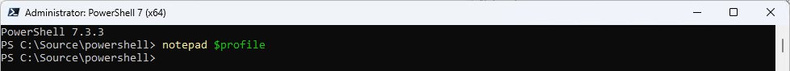

If it states it cannot find the file and asks you if it should create a new file, answer with **Yes**.

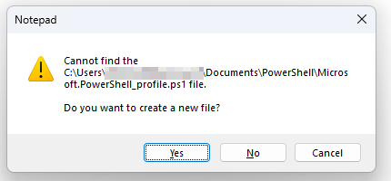

In the profile file, add the following line:

```powershell	
$Host.UI.RawUI.WindowTitle = "[PID: $PID] : PowerShell $($PSVersionTable.PSVersion)"
```

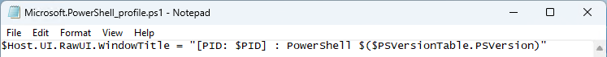

Save notepad and open a new PowerShell 7 window. It should now show the process ID in the title of the window.

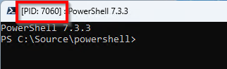