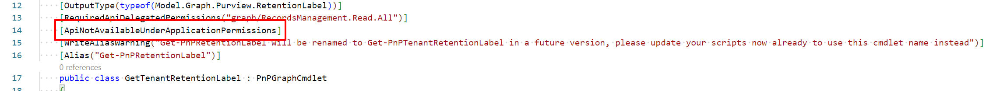
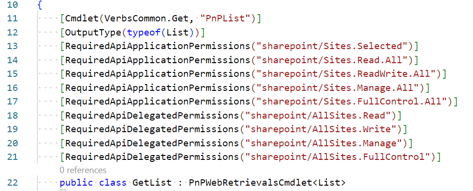
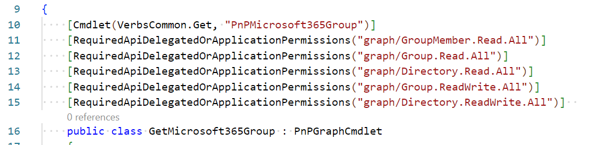

# Working with permission attributes

All cmdlet classes in code can be decorated with permission attributes. These attributes are used to define the permissions required to run the cmdlet. The permissions are checked before the cmdlet is executed. If the user does not have the required permissions, the cmdlet will throw a warning. It will still attempt to execute the cmdlet, but it will not be able to complete the operation if the user does not have the required permissions. This has been done in case the permissions defined in the attribute are not accurate, so that it will still work.

Types of permissions that can be used in the permission attributes are:

- [ApiNotAvailableUnderApplicationPermissions](#apinotavailableunderapplicationpermissions)
- [ApiNotAvailableUnderDelegatedPermissions](#apinotavailableunderdelegatedpermissions)
- [RequiredApiApplicationPermissions](#requiredapiapplicationpermissions)
- [RequiredApiDelegatedPermissions](#requiredapidelegatedpermissions)
- [RequiredApiDelegatedOrApplicationPermissions](#requiredapidelegatedorapplicationpermissions)

The attributes can be applied to the cmdlet class. The RequiredApi attributes take a string array as a parameter. The string array contains the permissions required to run the cmdlet. The permissions are defined in the format `resource/scope`. The resource is the resource that the permission is required for, and the permission is the permission that is required.

You can use the below table to find the supported resources you can use and what they map to in an Entra ID Application Registration:

| Resource | Entra ID API permsision | Microsoft APIs | APIs my organization uses |
|----------|-------------|----------|-------------|
| sharepoint | SharePoint | X | |
| graph | Microsoft Graph | X | |
| exchangeonline | Office 365 Exchange Online | | X |
| azure | Azure Service Management | X | |
| flow | Power Automate | X | |
| powerapps | PowerApps Service |  | X |
| dynamics | Dynamics CRM | X | |

You can combine multiple permissions in the same attribute. They can be from the same resource or from different resources. The syntax how to apply them would be like:

```csharp
[RequiredApiApplicationPermissions("sharepoint/Sites.Read.All", "graph/Group.Read.All")]
```

This sample would require both the `Sites.Read.All` on SharePoint and the `Group.Read.All` on Microsoft Graph permissions to be present in the application registration under the application permissions type.

If multiple attributes are defined on a cmdlet, the cmdlet will require only one of the permissions defined in the attributes to run. They are treated as an OR condition towards eachother. I.e. the following permission attributes would define that only one of the permissions is required to run the cmdlet:

```csharp
[RequiredApiDelegatedOrApplicationPermissions("graph/GroupMember.Read.All")]
[RequiredApiDelegatedOrApplicationPermissions("graph/Group.Read.All")]
[RequiredApiDelegatedOrApplicationPermissions("graph/Directory.Read.All")]
[RequiredApiDelegatedOrApplicationPermissions("graph/Group.ReadWrite.All")]
[RequiredApiDelegatedOrApplicationPermissions("graph/Directory.ReadWrite.All")]  
```

If you have a scenario that a combination of permissions is required, you can define multiple permissions in the same attribute to have them be handled as an AND. I.e. the following permission attributes would define that all of the permissions are required to run the cmdlet:

```csharp
[RequiredApiDelegatedOrApplicationPermissions("graph/GroupMember.Read.All", "graph/Group.Read.All")]
```

## ApiNotAvailableUnderApplicationPermissions

This attribute indicates that the cmdlet cannot be run in the context of an application. If the cmdlet is run in the context of an application, a warning will be thrown.

Sample of where application permissions are not allowed:


Sample of how the attribute can be applied:


## ApiNotAvailableUnderDelegatedPermissions

This attribute indicates that the cmdlet cannot be run in the delegated context. If the cmdlet is run in a delegated context, a warning will be thrown.

## RequiredApiApplicationPermissions

This attribute indicates that the cmdlet requires specific application permissions to run. If the application does not have the required permissions, a warning will be thrown.

Sample of how the attribute can be applied:


## RequiredApiDelegatedPermissions

This attribute indicates that the cmdlet requires specific delegated permissions to run. If the delegate does not have the required permissions, a warning will be thrown.

Sample of how the attribute can be applied:


## RequiredApiDelegatedOrApplicationPermissions

This attribute indicates that the cmdlet requires specific permissions to run, which are the same for a delegate and an application context. If the delegate or application does not have the required permissions, a warning will be thrown.

Sample of how the attribute can be applied:

