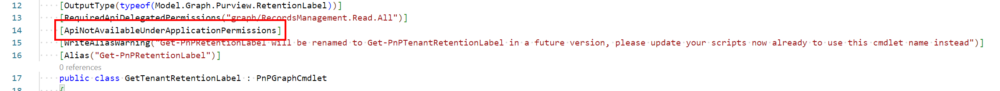
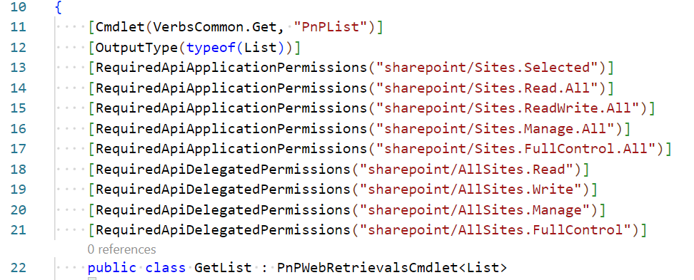
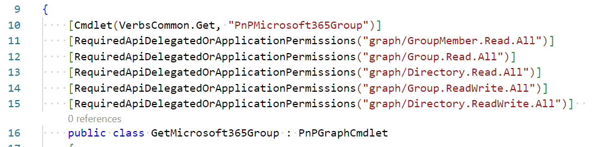

# Working with permission attributes

All cmdlet classes in code can be decorated with permission attributes. These attributes are used to define the permissions required to run the cmdlet. The permissions are checked before the cmdlet is executed. If the user does not have the required permissions, the cmdlet will throw a warning. It will still attempt to execute the cmdlet, but it will not be able to complete the operation if the user does not have the required permissions. This has been done in case the permissions defined in the attribute are not accurate, so that it will still work.

Types of permissions that can be used in the permission attributes are:

- [ApiNotAvailableUnderApplicationPermissions](#apinotavailableunderapplicationpermissions)
- [ApiNotAvailableUnderDelegatedPermissions](#apinotavailableunderdelegatedpermissions)
- [RequiredApiApplicationPermissions](#requiredapiapplicationpermissions)
- [RequiredApiDelegatedPermissions](#requiredapidelegatedpermissions)
- [RequiredApiDelegatedOrApplicationPermissions](#requiredapidelegatedorapplicationpermissions)
- [ApiPermissionsDependOnResource](#apipermissionsdependonresource)
- [ApiPermissionsNotRequired](#apipermissionsnotrequired)

The attributes can be applied to the cmdlet class. The RequiredApi attributes take a string array as a parameter. The string array contains the permissions required to run the cmdlet. The permissions are defined in the format `resource/scope`. The resource is the resource that the permission is required for, and the permission is the permission that is required.

You can use the below table to find the supported resources you can use and what they map to in an Entra ID Application Registration:

| Resource | Entra ID API permission | Microsoft APIs | APIs my organization uses |
|----------|-------------|----------|-------------|
| sharepoint | SharePoint | X | |
| graph | Microsoft Graph | X | |
| exchangeonline | Office 365 Exchange Online | | X |
| azure | Azure Service Management | X | |
| flow | Power Automate | X | |
| powerapps | PowerApps Service |  | X |
| dynamics | Dynamics CRM | X | |

You can combine multiple permissions in the same attribute. They can be from the same resource or from different resources. The syntax how to apply them would be like:

```csharp
[RequiredApiApplicationPermissions("sharepoint/Sites.Read.All", "graph/Group.Read.All")]
```

This sample would require both the `Sites.Read.All` on SharePoint and the `Group.Read.All` on Microsoft Graph permissions to be present in the application registration under the application permissions type.

If multiple attributes are defined on a cmdlet, the cmdlet will require only one of the permissions defined in the attributes to run. They are treated as an OR condition towards eachother. I.e. the following permission attributes would define that only one of the permissions is required to run the cmdlet:

```csharp
[RequiredApiDelegatedOrApplicationPermissions("graph/GroupMember.Read.All")]
[RequiredApiDelegatedOrApplicationPermissions("graph/Group.Read.All")]
[RequiredApiDelegatedOrApplicationPermissions("graph/Directory.Read.All")]
[RequiredApiDelegatedOrApplicationPermissions("graph/Group.ReadWrite.All")]
[RequiredApiDelegatedOrApplicationPermissions("graph/Directory.ReadWrite.All")]  
```

These attributes should be added starting with the least privileged one at the top going down towards the most privileged permission.

If you have a scenario that a combination of permissions is required, you can define multiple permissions in the same attribute to have them be handled as an AND. I.e. the following permission attributes would define that all of the permissions are required to run the cmdlet:

```csharp
[RequiredApiDelegatedOrApplicationPermissions("graph/GroupMember.Read.All", "graph/Group.Read.All")]
```

## ApiNotAvailableUnderApplicationPermissions

This attribute indicates that the cmdlet cannot be run in the context of an application. If the cmdlet is run in the context of an application, a warning will be thrown.

Sample of where application permissions are not allowed:


Sample of how the attribute can be applied:


## ApiNotAvailableUnderDelegatedPermissions

This attribute indicates that the cmdlet cannot be run in the delegated context. If the cmdlet is run in a delegated context, a warning will be thrown.

## RequiredApiApplicationPermissions

This attribute indicates that the cmdlet requires specific application permissions to run. If the application does not have the required permissions, a warning will be thrown.

Sample of how the attribute can be applied:


## RequiredApiDelegatedPermissions

This attribute indicates that the cmdlet requires specific delegated permissions to run. If the delegate does not have the required permissions, a warning will be thrown.

Sample of how the attribute can be applied:


## RequiredApiDelegatedOrApplicationPermissions

This attribute indicates that the cmdlet requires specific permissions to run, which are the same for a delegate and an application context. If the delegate or application does not have the required permissions, a warning will be thrown.

Sample of how the attribute can be applied:


## ApiPermissionsDependOnResource

Some cmdlets do not have a fixed set of required permissions, because the permissions follow from the resource the cmdlet is pointed at at runtime. The Microsoft Graph change notification cmdlets are an example: `New-PnPGraphSubscription` requires read permissions on the resource being subscribed to, so subscribing to messages requires `Mail.Read` while subscribing to a SharePoint list requires `Sites.Read.All`. `Invoke-PnPGraphMethod` is another: it requires whichever permissions the endpoint passed to `-Url` requires.

For these cmdlets, declaring a `RequiredApi*Permissions` attribute would be inaccurate and would cause a warning for users who hold the correct permission for their resource but not the one that happens to be declared. Use this attribute instead:

```csharp
[ApiPermissionsDependOnResource(
    ParameterName = nameof(Resource),
    Remarks = "Microsoft Graph requires read permissions on the resource being subscribed to, i.e. Mail.Read to subscribe to messages.",
    DocumentationUrl = "https://learn.microsoft.com/graph/api/subscription-post-subscriptions?view=graph-rest-1.0#permissions")]
```

The attribute exposes four properties, all optional:

| Property | Purpose |
|----------|---------|
| `ResourceType` | The API the permissions are needed on. Defaults to `Graph`. Even though the exact scopes cannot be stated, the API is known, and this is what `Get-PnPCommandPermission -ResourceTypeName` filters on. **Set it explicitly when the API is not Microsoft Graph**, otherwise the cmdlet is reported against the wrong API. |
| `ParameterName` | The parameter of which the value determines the permissions. Omit it when the resource does not come from a parameter, i.e. when it follows from an existing subscription addressed by its id, or when the condition is the *absence* of a parameter, as the generated text reads "follow from the value provided to -X". |
| `Remarks` | Explains which permissions are needed and under which condition. This is where the detail belongs. |
| `DocumentationUrl` | Link to the table listing the permissions per resource. |
| `ApiIsAlternativeToSharePoint` | Set this on a SharePoint cmdlet which reaches its goal either through the declared API or through SharePoint depending on how it is invoked, i.e. `Send-PnPMail`. The SharePoint permission is then reported as an alternative to the declared permissions rather than as a requirement next to them. |

Unlike the other attributes on this page, this attribute is purely informational. It is surfaced through `Get-PnPCommandPermission`, which reports these cmdlets with a `PermissionSource` of `ResourceDependent` rather than `Unknown`, and it is deliberately not evaluated when validating an access token, so it can never produce a warning.

## ApiPermissionsNotRequired

Where a cmdlet declares no permissions at all, `Get-PnPCommandPermission` derives them from the base class the cmdlet uses. That works for the vast majority of cmdlets, but not for cmdlets which use a connected base class without actually calling an API. `Get-PnPContext` derives from `PnPSharePointCmdlet` but only returns the client context held in memory, and `Register-PnPEntraIDApp` calls Microsoft Graph using a token it acquires itself rather than through the PnP connection. Without a marker these would be reported as requiring permissions they do not need.

Apply this attribute to such cmdlets:

```csharp
[ApiPermissionsNotRequired(Remarks = "This cmdlet returns the client context currently held in memory and performs no request.")]
```

The optional `Remarks` are appended to the guidance returned by `Get-PnPCommandPermission` and are the place to state which rights *are* needed instead, i.e. a directory role. Like `ApiPermissionsDependOnResource` this attribute is informational only and is not evaluated when validating an access token.
